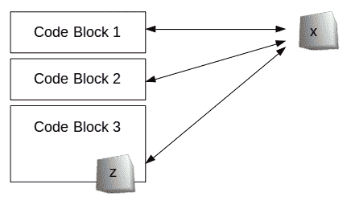

# 全局和局部变量

> 原文： [https://pythonspot.com/global-local-variables/](https://pythonspot.com/global-local-variables/)

变量有两种类型：**全局变量**和**局部变量**。
全局变量可以在代码中的任何位置访问，局部变量只能在[范围](https://pythonspot.com/scope/)中访问。



A **global variable** (x) can be reached and modified anywhere in the code, **local variable** (z) exists only in block 3.

## 局部变量

Local variables can only be reached in their scope.
The example below has two local variables: x and y.

```py

def sum(x,y):
    sum = x + y
    return sum

print(sum(8,6))

```

变量 x 和 y 只能在函数 sum 之内使用，而在函数外部则不存在。
局部变量不能在其范围之外使用，此行将不起作用：

```py

print(x)

```

## 全局变量

A global variable can be used anywhere in the code.
In the example below we define a global variable z

```py

z = 10

def afunction():
    global z
    print(z)

afunction()
print(z)

```

全局变量 z 可以在整个程序中，函数内部或外部使用。
可以在函数内部修改全局变量，并为整个程序进行更改：

```py

z = 10

def afunction():
    global z
    z = 9

afunction()
print(z)

```

调用 afunction（）之后，将更改整个程序的全局变量。

## 练习

Local and global variables can be used together in the same program.
Try to determine the output of this program:

```py

z = 10

def func1():
    global z
    z = 3

def func2(x,y):
    global z
    return x+y+z

func1()
total = func2(4,5)
print(total)

```

[下载 Python 练习](https://pythonspot.com/download-python-exercises/)