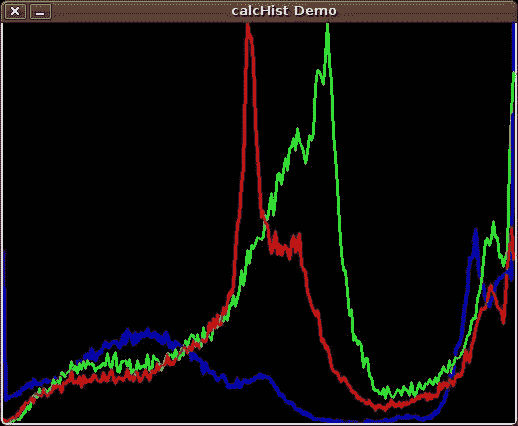

# 图像直方图

> 原文： [https://pythonspot.com/image-histogram/](https://pythonspot.com/image-histogram/)

直方图收集 n 个数据，这些数据被组织到一组箱子中。每个档位都显示频率。 OpenCV 可以为彩色和灰度图像生成直方图。 您可能需要将直方图用于计算机视觉任务。

## 直方图示例

给定图像，我们可以生成蓝色，绿色和红色值的直方图。



直方图计算

我们使用函数`cv.CalcHist(image, channel, mask, histSize, range)`

参数：

*   `image`：应放在方括号中，类型为`uint8`或`float32`的源图像
*   `channel`：要选择的颜色通道。`[0]`用于灰度。 彩色图像具有蓝色，绿色和红色通道
*   `mask`：如果您想要整个图像的直方图，则不适用，否则为一个区域。
*   `histSize`：箱数
*   `range`：颜色范围：

彩色图像的直方图：

```py
# draw histogram in python.
import cv2
import numpy as np

img = cv2.imread('image.jpg')
h = np.zeros((300,256,3))

bins = np.arange(256).reshape(256,1)
color = [ (255,0,0),(0,255,0),(0,0,255) ]

for ch, col in enumerate(color):
    hist_item = cv2.calcHist([img],[ch],None,[256],[0,255])
    cv2.normalize(hist_item,hist_item,0,255,cv2.NORM_MINMAX)
    hist=np.int32(np.around(hist_item))
    pts = np.column_stack((bins,hist))
    cv2.polylines(h,[pts],False,col)

    h=np.flipud(h)

    cv2.imshow('colorhist',h)
    cv2.waitKey(0)

```