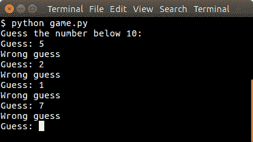

# Python 和简单文字游戏

> 原文： [https://pythonspot.com/simple-text-game](https://pythonspot.com/simple-text-game)

在本文中，我们将演示如何创建一个简单的猜谜游戏。
游戏的目的是猜测正确的数字。

## 示例

下面运行示例：



Simple text game with Python

## 随机数

The user will be asked to guess the random number. We first pick the random number:

```py
from random import randint

x = randint(1,9)

```

randint（）函数将选择一个介于 1 到 10 之间的伪随机数。然后，我们必须继续直到找到正确的数字为止：

```py
guess = -1

print("Guess the number below 10:")
while guess != x:
    guess = int(raw_input("Guess: "))

    if guess != x:
        print("Wrong guess")
    else:
        print("Guessed correctly")

```

## Python 猜测游戏

The code below starts the game:

```py
from random import randint

x = randint(1,9)
guess = -1

print "Guess the number below 10:"
while guess != x:
    guess = int(raw_input("Guess: "))

    if guess != x:
        print("Wrong guess")
    else:
        print("Guessed correctly")

```

运行示例：

```py
Guess the number below 10:
Guess: 3
Wrong guess
Guess: 6
Wrong guess
..

```