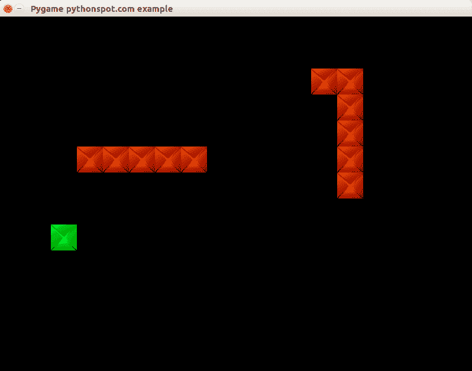

# Pygame 中的贪食蛇 AI

> 原文： [https://pythonspot.com/snake-ai-in-pygame/](https://pythonspot.com/snake-ai-in-pygame/)

在本文中，我们将向您展示如何创建基本的游戏 AI（人工智能）。 本文将介绍游戏蛇的 AI。

在此游戏（蛇）中，计算机和您都在玩蛇，而计算机蛇会尝试抓住您。 简而言之：对手 AI 会根据您在棋盘上的位置尝试确定并前往目的地。

## 添加计算机玩家：

我们使用名为 Computer 的新类扩展了代码，它将成为我们的计算机玩家。 这包含绘制和移动计算机蛇的例程。

```py
class Computer:
    x = [0]
    y = [0]
    step = 44
    direction = 0
    length = 3

    updateCountMax = 2
    updateCount = 0

    def __init__(self, length):
       self.length = length
       for i in range(0,2000):
           self.x.append(-100)
           self.y.append(-100)

       # initial positions, no collision.
       self.x[0] = 1*44
       self.y[0] = 4*44

    def update(self):

        self.updateCount = self.updateCount + 1
        if self.updateCount &gt; self.updateCountMax:

            # update previous positions
            for i in range(self.length-1,0,-1):
                self.x[i] = self.x[i-1]
                self.y[i] = self.y[i-1]

            # update position of head of snake
            if self.direction == 0:
                self.x[0] = self.x[0] + self.step
            if self.direction == 1:
                self.x[0] = self.x[0] - self.step
            if self.direction == 2:
                self.y[0] = self.y[0] - self.step
            if self.direction == 3:
                self.y[0] = self.y[0] + self.step

            self.updateCount = 0

    def moveRight(self):
        self.direction = 0

    def moveLeft(self):
        self.direction = 1

    def moveUp(self):
        self.direction = 2

    def moveDown(self):
        self.direction = 3 

    def draw(self, surface, image):
        for i in range(0,self.length):
            surface.blit(image,(self.x[i],self.y[i])) 

```

然后，我们调用计算机的更新和绘制方法。

```py
    def on_loop(self):
        self.player.update()
        self.computer.update()

....

    def on_render(self):
        self._display_surf.fill((0,0,0))
        self.player.draw(self._display_surf, self._image_surf)
        self.apple.draw(self._display_surf, self._apple_surf)
        self.computer.draw(self._display_surf, self._image_surf)
        pygame.display.flip()

```

这将使计算机蛇移动并在屏幕上绘制。 它具有与人类玩家相同的属性。

## 为计算机玩家添加智能

因为这是一个简单的游戏，所以我们无需在游戏内部创建完整的思维机。 我们只需要计算机玩家展示一些基本情报即可。 游戏中的智能通常非常有限，因为在大多数情况下，不需要复杂性或根本没有时间实现聪明的算法。

我们将添加的算法将仅到达目的地。 它将忽略任何障碍（人类玩家）。

```py
def target(self,dx,dy):
    if self.x[0] &gt; dx:
        self.moveLeft()

    if self.x[0] &lt; dx:
        self.moveRight()

    if self.x[0] == dx:
        if self.y[0] &lt; dy:
            self.moveDown()

        if self.y[0] &gt; dy:
            self.moveUp()

```

## 完整代码

我们得到以下完整代码：

```py
from pygame.locals import *
from random import randint
import pygame
import time

class Apple:
    x = 0
    y = 0
    step = 44

    def __init__(self,x,y):
        self.x = x * self.step
        self.y = y * self.step

    def draw(self, surface, image):
        surface.blit(image,(self.x, self.y)) 

class Player:
    x = [0]
    y = [0]
    step = 44
    direction = 0
    length = 3

    updateCountMax = 2
    updateCount = 0

    def __init__(self, length):
       self.length = length
       for i in range(0,2000):
           self.x.append(-100)
           self.y.append(-100)

       # initial positions, no collision.
       self.x[0] = 1*44
       self.x[0] = 2*44

    def update(self):

        self.updateCount = self.updateCount + 1
        if self.updateCount &gt; self.updateCountMax:

            # update previous positions
            for i in range(self.length-1,0,-1):
                self.x[i] = self.x[i-1]
                self.y[i] = self.y[i-1]

            # update position of head of snake
            if self.direction == 0:
                self.x[0] = self.x[0] + self.step
            if self.direction == 1:
                self.x[0] = self.x[0] - self.step
            if self.direction == 2:
                self.y[0] = self.y[0] - self.step
            if self.direction == 3:
                self.y[0] = self.y[0] + self.step

            self.updateCount = 0

    def moveRight(self):
        self.direction = 0

    def moveLeft(self):
        self.direction = 1

    def moveUp(self):
        self.direction = 2

    def moveDown(self):
        self.direction = 3 

    def draw(self, surface, image):
        for i in range(0,self.length):
            surface.blit(image,(self.x[i],self.y[i])) 

class Computer:
    x = [0]
    y = [0]
    step = 44
    direction = 0
    length = 3

    updateCountMax = 2
    updateCount = 0

    def __init__(self, length):
       self.length = length
       for i in range(0,2000):
           self.x.append(-100)
           self.y.append(-100)

       # initial positions, no collision.
       self.x[0] = 1*44
       self.y[0] = 4*44

    def update(self):

        self.updateCount = self.updateCount + 1
        if self.updateCount &gt; self.updateCountMax:

            # update previous positions
            for i in range(self.length-1,0,-1):
                self.x[i] = self.x[i-1]
                self.y[i] = self.y[i-1]

            # update position of head of snake
            if self.direction == 0:
                self.x[0] = self.x[0] + self.step
            if self.direction == 1:
                self.x[0] = self.x[0] - self.step
            if self.direction == 2:
                self.y[0] = self.y[0] - self.step
            if self.direction == 3:
                self.y[0] = self.y[0] + self.step

            self.updateCount = 0

    def moveRight(self):
        self.direction = 0

    def moveLeft(self):
        self.direction = 1

    def moveUp(self):
        self.direction = 2

    def moveDown(self):
        self.direction = 3 

    def target(self,dx,dy):
        if self.x[0] &gt; dx:
            self.moveLeft()

        if self.x[0] &lt; dx:
            self.moveRight()

        if self.x[0] == dx:
            if self.y[0] &lt; dy:
                self.moveDown()

            if self.y[0] &gt; dy:
                self.moveUp()

    def draw(self, surface, image):
        for i in range(0,self.length):
            surface.blit(image,(self.x[i],self.y[i])) 

class Game:
    def isCollision(self,x1,y1,x2,y2,bsize):
        if x1 &gt;= x2 and x1 &lt;= x2 + bsize:
            if y1 &gt;= y2 and y1 &lt;= y2 + bsize:
                return True
        return False

class App:

    windowWidth = 800
    windowHeight = 600
    player = 0
    apple = 0

    def __init__(self):
        self._running = True
        self._display_surf = None
        self._image_surf = None
        self._apple_surf = None
        self.game = Game()
        self.player = Player(5) 
        self.apple = Apple(8,5)
        self.computer = Computer(5)

    def on_init(self):
        pygame.init()
        self._display_surf = pygame.display.set_mode((self.windowWidth,self.windowHeight), pygame.HWSURFACE)

        pygame.display.set_caption('Pygame pythonspot.com example')
        self._running = True
        self._image_surf = pygame.image.load("pygame.png").convert()
        self._apple_surf = pygame.image.load("apple.png").convert()

    def on_event(self, event):
        if event.type == QUIT:
            self._running = False

    def on_loop(self):
        self.computer.target(self.apple.x, self.apple.y)
        self.player.update()
        self.computer.update()

        # does snake eat apple?
        for i in range(0,self.player.length):
            if self.game.isCollision(self.apple.x,self.apple.y,self.player.x[i], self.player.y[i],44):
                self.apple.x = randint(2,9) * 44
                self.apple.y = randint(2,9) * 44
                self.player.length = self.player.length + 1

        # does computer eat apple?
        for i in range(0,self.player.length):
            if self.game.isCollision(self.apple.x,self.apple.y,self.computer.x[i], self.computer.y[i],44):
                self.apple.x = randint(2,9) * 44
                self.apple.y = randint(2,9) * 44
                #self.computer.length = self.computer.length + 1

        # does snake collide with itself?
        for i in range(2,self.player.length):
            if self.game.isCollision(self.player.x[0],self.player.y[0],self.player.x[i], self.player.y[i],40):
                print "You lose! Collision: "
                print "x[0] (" + str(self.player.x[0]) + "," + str(self.player.y[0]) + ")"  
                print "x[" + str(i) + "] (" + str(self.player.x[i]) + "," + str(self.player.y[i]) + ")"  
                exit(0)

        pass

    def on_render(self):
        self._display_surf.fill((0,0,0))
        self.player.draw(self._display_surf, self._image_surf)
        self.apple.draw(self._display_surf, self._apple_surf)
        self.computer.draw(self._display_surf, self._image_surf)
        pygame.display.flip()

    def on_cleanup(self):
        pygame.quit()

    def on_execute(self):
        if self.on_init() == False:
            self._running = False

        while( self._running ):
            pygame.event.pump()
            keys = pygame.key.get_pressed() 

            if (keys[K_RIGHT]):
                self.player.moveRight()

            if (keys[K_LEFT]):
                self.player.moveLeft()

            if (keys[K_UP]):
                self.player.moveUp()

            if (keys[K_DOWN]):
                self.player.moveDown()

            if (keys[K_ESCAPE]):
                self._running = False

            self.on_loop()
            self.on_render()

            time.sleep (50.0 / 1000.0);
        self.on_cleanup()

if __name__ == "__main__" :
    theApp = App()
    theApp.on_execute()

```



python snake

## 结论

您学习了如何使用非常简单的 AI 算法创建基本的计算机玩家。

[下一步：学习基本的侧滑器逻辑](https://pythonspot.com/jump-and-run-in-pygame/)