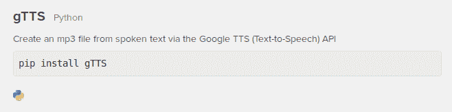

# Python 中的个人助理（Jarvis）

> 原文： [https://pythonspot.com/personal-assistant-jarvis-in-python/](https://pythonspot.com/personal-assistant-jarvis-in-python/)

我认为在 [**Python**](https://pythonspot.com) 中创建**个人助理**很酷。 如果您喜欢电影，可能已经听说过 A.I. Jarvis。 钢铁侠电影中的角色 在本教程中，我们将创建 [**机器人**](https://pythonspot.com/robotics)。

我要拥有的功能是：

*   [**识别语音（语音识别）**](https://pythonspot.com/speech-recognition-using-google-speech-api/)
*   [**口头回答（文本到语音）**](https://pythonspot.com/speech-engines-with-python-tutorial/)
*   回答简单的命令

对于本教程，您将需要（Ubuntu）Linux，[**Python**](https://pythonspot.com) 和可正常使用的麦克风。

#### 视频

这是您要创建的（观看整个视频，最后是演示）：

<https://www.youtube-nocookie.com/embed/ErGAhUa_rlA?rel=0>

### 识别语音

可以使用 Python 语音识别模块完成语音识别。我们使用 [Google Speech API](https://pythonspot.com/speech-recognition-using-google-speech-api/)，因为它的质量很高。

### 以语音回答（文字转语音）

各种 **API 和程序**可用于[文本到语音的应用程序](https://pythonspot.com/speech-engines-with-python-tutorial/)。Espeak 和 pyttsx 开箱即用，但听起来很机器人。我们决定使用 Google 文字到语音 API gTTS。

```py

sudo pip install gTTS

```

使用它很简单：

```py

from gtts import gTTS
import os
tts = gTTS(text='Hello World', lang='en')
tts.save("hello.mp3")
os.system("mpg321 hello.mp3")

```



### 完整程序

下面的程序将回答口头问题。

```py

#!/usr/bin/env python3
# Requires PyAudio and PySpeech.

import speech_recognition as sr
from time import ctime
import time
import os
from gtts import gTTS

def speak(audioString):
    print(audioString)
    tts = gTTS(text=audioString, lang='en')
    tts.save("audio.mp3")
    os.system("mpg321 audio.mp3")

def recordAudio():
    # Record Audio
    r = sr.Recognizer()
    with sr.Microphone() as source:
    print("Say something!")
    audio = r.listen(source)

    # Speech recognition using Google Speech Recognition
    data = ""
    try:
        # Uses the default API key
        # To use another API key: `r.recognize_google(audio, key="GOOGLE_SPEECH_RECOGNITION_API_KEY")`
        data = r.recognize_google(audio)
        print("You said: " + data)
    except sr.UnknownValueError:
        print("Google Speech Recognition could not understand audio")
    except sr.RequestError as e:
        print("Could not request results from Google Speech Recognition service; {0}".format(e))

    return data

def jarvis(data):
    if "how are you" in data:
        speak("I am fine")

    if "what time is it" in data:
        speak(ctime())

    if "where is" in data:
        data = data.split(" ")
        location = data[2]
        speak("Hold on Frank, I will show you where " + location + " is.")
        os.system("chromium-browser https://www.google.nl/maps/place/" + location + "/&amp;")

# initialization
time.sleep(2)
speak("Hi Frank, what can I do for you?")
while 1:
    data = recordAudio()
    jarvis(data)

```

### 相关文章：

*   [**机器人技术，计算机视觉和超赞的内容**](https://pythonspot.com/robotics)

*   [**语音引擎（TTS）**](https://pythonspot.com/speech-engines-with-python-tutorial/)

*   [**语音识别**](https://pythonspot.com/speech-recognition-using-google-speech-api/)