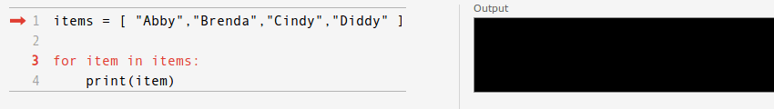

# 循环：`For`循环，`while`循环

> 原文： [https://pythonspot.com/loops/](https://pythonspot.com/loops/)

可以使用循环来重复代码。 代码行可以重复 N 次，其中 N 是可以手动配置的。 实际上，这意味着将重复执行代码，直到满足条件为止。 此条件通常为（x &gt; = N），但这不是唯一可能的条件。

Python 有 3 种循环类型：for 循环，while 循环和嵌套循环。

## `for`循环

We can iterate a list using a for loop

```py
#!/usr/bin/python

items = [ "Abby","Brenda","Cindy","Diddy" ]

for item in items:
    print(item)

```

for 循环的可视化：
[&lt;picture&gt;&lt;source srcset="/wp-content/uploads/2016/03/for-loop-animation.gif.webp" type="image/webp"&gt; &lt;source srcset="/wp-content/uploads/2016/03/for-loop-animation.gif" type="image/jpeg"&gt; &lt;/picture&gt; ](/wp-content/uploads/2016/03/for-loop-animation.gif)

for 循环也可以重复 N 次：

```py
#!/usr/bin/python

for i in range(1,10):
    print(i)

```

## `While`循环

If you are unsure how many times a code should be repeated, use a while loop.
For example,

```py

correctNumber = 5
guess = 0

while guess != correctNumber:
    guess = int(input("Guess the number: "))

    if guess != correctNumber:
        print('False guess')

print('You guessed the correct number')

```

## 嵌套循环

We can combine for loops using nesting. If we want to iterate over an (x,y) field we could use:

```py
#!/usr/bin/python

for x in range(1,10):
    for y in range(1,10):
        print("(" + str(x) + "," + str(y) + ")")

```

嵌套非常有用，但是嵌套得越深，它就会增加复杂性。

[下载 Python 练习](https://pythonspot.com/download-python-exercises/)