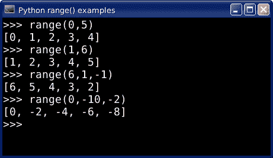

# Python 范围

> 原文： [https://pythonspot.com/python-range/](https://pythonspot.com/python-range/)

**range（）**函数的 return 会生成一个数字序列，从下限到上限。

```py

range(lower_bound, upper_bound, step_size)

```

*   lower_bound：_ 列表的起始值。_

*   upper_bound：_ 列表的最大值，不包括此数字。_

*   step_bound：_ 步长，列表中每个数字之间的差。_

The lower_bound and step_size parameters are optional. By default the lower bound is set to zero, the incremental step is set to one. The parameters must be of the type integers, but may be negative.

The python range function in the interpreter

## 范围实现差异

通常是一个问题。 在 Python 版本中，range（）的实现略有不同：

*   Python 2.x： _range（）函数返回一个列表。_

*   Python 3.x： _range（）函数生成一个序列。_

## range in python 2.7

A call to range(5) will return: 0,1,2,3,4.

```py

&gt;&gt;&gt; range(5)

```

调用 range（1,10）返回：1,2,3,4,5,6,7,8,9

```py

&gt;&gt;&gt; range(1,10)

```

调用范围（0,10,2）返回：0,2,4,6,8

```py

&gt;&gt;&gt; range(0,10,2)

```

python 3 中的**范围**
要使用范围生成列表，请添加列表功能

```py

&gt;&gt;&gt; list(range(5))

```

我们可以使用所有参数（下限，上限，步长）

```py

&gt;&gt;&gt; list(range(0,10,2))
[0, 2, 4, 6, 8]

```

## python 2 实现

此版本的 range（）分配计算机内存，并在后台填充计算机内存。 对于大范围，这不是很有效的实现。

通常，range2 的 Python2 实现不会有任何问题，但如果使用大量（数百万个项目），则可能会遇到问题。

[下载 Python 练习](https://pythonspot.com/download-python-exercises/)