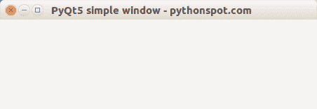

# PyQt5 窗口

> 原文： [https://pythonspot.com/pyqt5-window/](https://pythonspot.com/pyqt5-window/)

如果您尚未安装 [PyQT5](https://pythonspot.com/pyqt5/) ，则应先安装。 在终端中，您可以输入：

```
sudo apt-get install python3-pyqt5

```

如果您使用 Windows 或 Mac 计算机，则可以从以下网站下载 [PyQT5](https://pythonspot.com/pyqt5/) ： [https://www.riverbankcomputing.com/software/pyqt/download5](https://www.riverbankcomputing.com/software/pyqt/download5)

**相关课程：**

*   [使用 PyQt5 创建 GUI 应用](https://gum.co/pysqtsamples)

## PyQt5 窗口

You can create a **[PyQT5](https://pythonspot.com/pyqt5/)** window using the code below:

```
import sys
from PyQt5.QtWidgets import QApplication, QWidget
from PyQt5.QtGui import QIcon

class App(QWidget):

    def __init__(self):
        super().__init__()
        self.title = 'PyQt5 simple window - pythonspot.com'
        self.left = 10
        self.top = 10
        self.width = 640
        self.height = 480
        self.initUI()

    def initUI(self):
        self.setWindowTitle(self.title)
        self.setGeometry(self.left, self.top, self.width, self.height)
        self.show()

if __name__ == '__main__':
    app = QApplication(sys.argv)
    ex = App()
    sys.exit(app.exec_())

```

我们使用 setGeometry（left，top，width，height）方法设置窗口大小。 使用 setWindowTitle（title）设置窗口标题。 最后调用 show（）以显示窗口。

运行：

```
python3 window.py

```



[下载 PyQT5 代码](https://pythonspot.com/download-pyqt5-examples/)

输出看起来应该类似于上面的屏幕截图（取决于您的操作系统）。