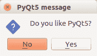

# PyQt5 消息框

> 原文： [https://pythonspot.com/pyqt5-messagebox/](https://pythonspot.com/pyqt5-messagebox/)

在本文中，您将学习如何创建 [**PyQt5**](https://pythonspot.com/pyqt5/) 消息框：



为了显示一个消息框，我们需要导入 **QMessageBox** 。

```
from PyQt5.QtWidgets import QApplication, QWidget, QPushButton, QMessageBox

```

我们使用方法 **QMessageBox.question（）**显示消息框。

## PyQt5 消息框代码

复制以下代码以显示消息框。

```
import sys
from PyQt5.QtWidgets import QApplication, QWidget, QPushButton, QMessageBox
from PyQt5.QtGui import QIcon
from PyQt5.QtCore import pyqtSlot

class App(QWidget):

    def __init__(self):
        super().__init__()
        self.title = 'PyQt5 messagebox - pythonspot.com'
        self.left = 10
        self.top = 10
        self.width = 320
        self.height = 200
        self.initUI()

    def initUI(self):
        self.setWindowTitle(self.title)
        self.setGeometry(self.left, self.top, self.width, self.height)

        buttonReply = QMessageBox.question(self, 'PyQt5 message', "Do you like PyQt5?", QMessageBox.Yes | QMessageBox.No, QMessageBox.No)
        if buttonReply == QMessageBox.Yes:
            print('Yes clicked.')
        else:
            print('No clicked.')

        self.show()

if __name__ == '__main__':
    app = QApplication(sys.argv)
    ex = App()
    sys.exit(app.exec_())  

```

## 消息框的更多按钮

考虑到我们使用 **QMessageBox。是**和 **QMessageBox.No** 。 我们可以轻松添加其他选项：

```
buttonReply = QMessageBox.question(self, 'PyQt5 message', "Do you want to save?", QMessageBox.Yes | QMessageBox.No | QMessageBox.Cancel, QMessageBox.Cancel)
print(int(buttonReply))
if buttonReply == QMessageBox.Yes:
    print('Yes clicked.')
if buttonReply == QMessageBox.No:
    print('No clicked.')
if buttonReply == QMessageBox.Cancel:
    print('Cancel')

```

可用的按钮有：

| 总览 |  |  |
| QMessageBox.Cancel | QMessageBox.Ok | QMessageBox.Help |
| QMessageBox.Open | QMessageBox.Save | QMessageBox.SaveAll |
| QMessageBox.Discard | QMessageBox。关闭 | QMessageBox.Apply |
| QMessageBox.Reset | QMessageBox。是 | QMessageBox.YesToAll |
| QMessageBox.No | QMessageBox.NoToAll | QMessageBox.NoButton |
| QMessageBox.RestoreDefaults | QMessageBox.Abort | QMessageBox.Retry |
| QMessageBox.Ignore |

[下载 PyQT5 示例](https://pythonspot.com/download-pyqt5-examples/)