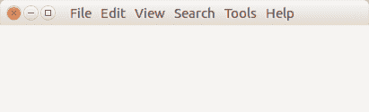

# PyQt5 菜单

> 原文： [https://pythonspot.com/pyqt5-menu/](https://pythonspot.com/pyqt5-menu/)

要为 [**PyQt5**](https://pythonspot.com/pyqt5/) 程序创建菜单，我们需要使用`QMainWindow`。 这种类型的菜单在许多应用程序中都可见，并显示在窗口栏的正下方。 它通常具有文件和编辑子菜单。

可以使用`menuBar()`方法创建顶部菜单。 子菜单添加了`addMenu(name)`。示例：

```py
mainMenu = self.menuBar()
fileMenu = mainMenu.addMenu('File')
editMenu = mainMenu.addMenu('Edit')
viewMenu = mainMenu.addMenu('View')
searchMenu = mainMenu.addMenu('Search')
toolsMenu = mainMenu.addMenu('Tools')
helpMenu = mainMenu.addMenu('Help')

```

可以将单个按钮添加到菜单中，如下所示：

```py
exitButton = QAction(QIcon('exit24.png'), 'Exit', self)
exitButton.setShortcut('Ctrl+Q')
exitButton.setStatusTip('Exit application')
exitButton.triggered.connect(self.close)
fileMenu.addAction(exitButton)

```

## PyQt5 菜单示例

完整代码：

```py
import sys
from PyQt5.QtWidgets import QMainWindow, QApplication, QWidget, QPushButton, QAction
from PyQt5.QtGui import QIcon
from PyQt5.QtCore import pyqtSlot

class App(QMainWindow):

    def __init__(self):
        super().__init__()
        self.title = 'PyQt5 menu - pythonspot.com'
        self.left = 10
        self.top = 10
        self.width = 640
        self.height = 400
        self.initUI()

    def initUI(self):
        self.setWindowTitle(self.title)
        self.setGeometry(self.left, self.top, self.width, self.height)

        mainMenu = self.menuBar()
        fileMenu = mainMenu.addMenu('File')
        editMenu = mainMenu.addMenu('Edit')
        viewMenu = mainMenu.addMenu('View')
        searchMenu = mainMenu.addMenu('Search')
        toolsMenu = mainMenu.addMenu('Tools')
        helpMenu = mainMenu.addMenu('Help')

        exitButton = QAction(QIcon('exit24.png'), 'Exit', self)
        exitButton.setShortcut('Ctrl+Q')
        exitButton.setStatusTip('Exit application')
        exitButton.triggered.connect(self.close)
        fileMenu.addAction(exitButton)

        self.show()

if __name__ == '__main__':
    app = QApplication(sys.argv)
    ex = App()
    sys.exit(app.exec_())

```

结果：



[下载 PyQT5 示例](https://pythonspot.com/download-pyqt5-examples/)