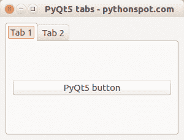

# PyQt5 标签

> 原文： [https://pythonspot.com/pyqt5-tabs/](https://pythonspot.com/pyqt5-tabs/)

在本文中，您将学习将选项卡与 [**PyQt5**](https://pythonspot.com/pyqt5/) 结合使用。 我们将首先显示完整的代码，然后进行解释。 PyQt5 有一个小部件来创建称为 QTabWidget 的选项卡。 QTabWidget 可以包含选项卡（QWidgets），这些选项卡上具有小部件，例如标签，按钮，图像等。



**PyQt5 标签示例** 完整 [**PyQt5**](https://pythonspot.com/pyqt5/) 标签示例：

```
import sys
from PyQt5.QtWidgets import QMainWindow, QApplication, QPushButton, QWidget, QAction, QTabWidget,QVBoxLayout
from PyQt5.QtGui import QIcon
from PyQt5.QtCore import pyqtSlot

class App(QMainWindow):

    def __init__(self):
        super().__init__()
        self.title = 'PyQt5 tabs - pythonspot.com'
        self.left = 0
        self.top = 0
        self.width = 300
        self.height = 200
        self.setWindowTitle(self.title)
        self.setGeometry(self.left, self.top, self.width, self.height)

        self.table_widget = MyTableWidget(self)
        self.setCentralWidget(self.table_widget)

        self.show()

class MyTableWidget(QWidget):

    def __init__(self, parent):
        super(QWidget, self).__init__(parent)
        self.layout = QVBoxLayout(self)

        # Initialize tab screen
        self.tabs = QTabWidget()
        self.tab1 = QWidget()
        self.tab2 = QWidget()
        self.tabs.resize(300,200)

        # Add tabs
        self.tabs.addTab(self.tab1,"Tab 1")
        self.tabs.addTab(self.tab2,"Tab 2")

        # Create first tab
        self.tab1.layout = QVBoxLayout(self)
        self.pushButton1 = QPushButton("PyQt5 button")
        self.tab1.layout.addWidget(self.pushButton1)
        self.tab1.setLayout(self.tab1.layout)

        # Add tabs to widget
        self.layout.addWidget(self.tabs)
        self.setLayout(self.layout)

    @pyqtSlot()
    def on_click(self):
        print("\n")
        for currentQTableWidgetItem in self.tableWidget.selectedItems():
            print(currentQTableWidgetItem.row(), currentQTableWidgetItem.column(), currentQTableWidgetItem.text())

if __name__ == '__main__':
    app = QApplication(sys.argv)
    ex = App()
    sys.exit(app.exec_())

```

**说明：**

要将表添加到窗口，我们创建一个新类：

```
class MyTableWidget(QWidget)

```

我们通过为标签创建一个 **QTabWidget** 和两个 **QWidgets** 来初始化标签屏幕。

```
self.tabs = QTabWidget()
self.tab1 = QWidget()
self.tab2 = QWidget()
self.tabs.resize(300,200)

```

然后，我们将这些选项卡添加到选项卡小部件中：

```
self.tabs.addTab(self.tab1,"Tab 1")
self.tabs.addTab(self.tab2,"Tab 2")

```

使用以下命令创建选项卡的内容：

```
self.tab1.layout = QVBoxLayout(self)
self.pushButton1 = QPushButton("PyQt5 button")
self.tab1.layout.addWidget(self.pushButton1)
self.tab1.setLayout(self.tab1.layout)

```

最后，我们将标签添加到小部件中：

```
self.layout.addWidget(self.tabs)
self.setLayout(self.layout)

```

不要忘记将您的自定义标签窗口小部件添加到窗口中：

```
self.table_widget = MyTableWidget(self)
self.setCentralWidget(self.table_widget)

```

[下载 PyQT5 示例](https://pythonspot.com/download-pyqt5-examples/)