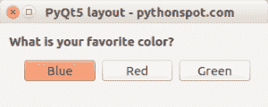

# PyQt5 水平布局

> 原文： [https://pythonspot.com/pyqt5-horizo​​ntal-layout/](https://pythonspot.com/pyqt5-horizontal-layout/)

窗口可以包含小部件（按钮，文本字段，图像等）。 窗口小部件经常添加到布局中。 水平布局可用于在水平方向上（动态）添加小部件。

在本文中，我们将向您展示如何使用水平布局在水平方向上添加按钮。



**相关课程：**

*   [使用 PyQt5 创建 GUI 应用](https://gum.co/pysqtsamples)

**水平布局示例** 我们将显示整个代码，然后进行解释。

```
import sys
from PyQt5.QtWidgets import QApplication, QWidget, QPushButton, QHBoxLayout, QGroupBox, QDialog, QVBoxLayout
from PyQt5.QtGui import QIcon
from PyQt5.QtCore import pyqtSlot

class App(QDialog):

    def __init__(self):
        super().__init__()
        self.title = 'PyQt5 layout - pythonspot.com'
        self.left = 10
        self.top = 10
        self.width = 320
        self.height = 100
        self.initUI()

    def initUI(self):
        self.setWindowTitle(self.title)
        self.setGeometry(self.left, self.top, self.width, self.height)

        self.createHorizontalLayout()

        windowLayout = QVBoxLayout()
        windowLayout.addWidget(self.horizontalGroupBox)
        self.setLayout(windowLayout)

        self.show()

    def createHorizontalLayout(self):
        self.horizontalGroupBox = QGroupBox("What is your favorite color?")
        layout = QHBoxLayout()

        buttonBlue = QPushButton('Blue', self)
        buttonBlue.clicked.connect(self.on_click)
        layout.addWidget(buttonBlue)

        buttonRed = QPushButton('Red', self)
        buttonRed.clicked.connect(self.on_click)
        layout.addWidget(buttonRed)

        buttonGreen = QPushButton('Green', self)
        buttonGreen.clicked.connect(self.on_click)
        layout.addWidget(buttonGreen)

        self.horizontalGroupBox.setLayout(layout)

    @pyqtSlot()
    def on_click(self):
        print('PyQt5 button click')

if __name__ == '__main__':
    app = QApplication(sys.argv)
    ex = App()
    sys.exit(app.exec_())

```

**解释**

我们首先在 initUI（）方法中调用 self.createHorizo​​ntalLayout（）方法。 在方法内部，我们创建了一个带有标题和水平布局的框：

```
self.horizontalGroupBox = QGroupBox("What is your favorite color?")
layout = QHBoxLayout()

```

我们创建小部件（在此示例中为 QPushButtons），并将它们一个接一个地添加到布局中：

```
buttonBlue = QPushButton('Blue', self)
buttonBlue.clicked.connect(self.on_click)
layout.addWidget(buttonBlue)

```

我们将标题框设置为包含水平布局：

```
self.horizontalGroupBox.setLayout(layout)

```

在 initUI 方法中，我们将其添加到窗口中：

```
windowLayout = QVBoxLayout()
windowLayout.addWidget(self.horizontalGroupBox)
self.setLayout(windowLayout)

```

[下载 PyQT5 示例](https://pythonspot.com/download-pyqt5-examples/)