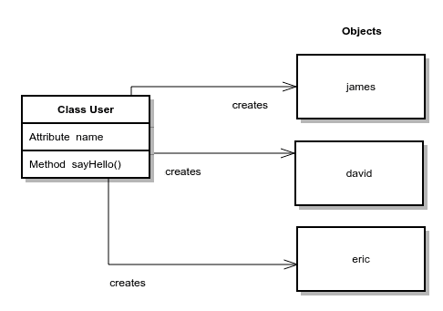

# Python 类：对象和类

> 原文： [https://pythonspot.com/objects-and-classes](https://pythonspot.com/objects-and-classes)

## 介绍

技术总是在发展。什么是类，它们从何而来？

**1.语句**：
在计算的早期，程序员仅编写命令。

**2.函数**：
可重用的语句组，有助于结构化代码并提高了可读性。

**3.类**：
这些类用于创建具有功能和变量的对象。 字符串是对象的示例：字符串书具有功能 book.replace（）和 book.lowercase（）。 这种样式通常称为面向对象编程。

让我们一起潜水吧！

## Python 类

我们可以在 Python 中创建虚拟对象。 虚拟对象可以包含变量和方法。 程序可能具有许多不同的类型，并且是从类创建的。 例：

```py
class User:
    name = ""

    def __init__(self, name):
        self.name = name

    def sayHello(self):
        print("Hello, my name is " + self.name)

# create virtual objects
james = User("James")
david = User("David")
eric = User("Eric")

# call methods owned by virtual objects
james.sayHello()
david.sayHello()

```

运行该程序。 在此代码中，我们有 3 个虚拟对象：james，david 和 eric。 每个对象都是 User 类的实例。



Python 类：创建对象

在此类中，我们定义了 sayHello（）方法，这就是为什么我们可以为每个对象调用它的原因。 **初始化**（）方法被称为**构造函数**，并且在创建对象时始终被调用。 该类拥有的变量在这种情况下为“名称”。 这些变量有时称为类属性。

我们可以在类中创建方法来更新对象的内部变量。 这听起来可能有些含糊，但我将举一个例子进行说明。

## 类变量

我们定义了一个`CoffeeMachine`类，其中的虚拟对象包含大量的咖啡豆和大量的水。 两者都定义为数字（整数）。然后我们可以定义添加或删除豆子的方法。

```py
def addBean(self):
    self.bean = self.bean + 1

def removeBean(self):
    self.bean = self.bean - 1

```

对于水，我们也是如此。如下所示：

```py
class CoffeeMachine:
    name = ""
    beans = 0
    water = 0

    def __init__(self, name, beans, water):
        self.name = name
        self.beans = beans
        self.water = water

    def addBean(self):
        self.beans = self.beans + 1

    def removeBean(self):
        self.beans = self.beans - 1

    def addWater(self):
        self.water = self.water + 1

    def removeWater(self):
        self.water = self.water - 1

    def printState(self):
        print "Name  = " + self.name
        print "Beans = " + str(self.beans)
        print "Water = " + str(self.water)

pythonBean = CoffeeMachine("Python Bean", 83, 20)
pythonBean.printState()
print ""
pythonBean.addBean()
pythonBean.printState()

```

运行该程序。 代码的顶部定义了我们所描述的类。 下面的代码是我们创建虚拟对象的地方。 在此示例中，我们只有一个对象称为“ pythonBean”。 然后我们调用更改内部变量的方法，这是可能的，因为我们在类中定义了这些方法。 输出：

```py

Name  = Python Bean
Beans = 83
Water = 20

Name  = Python Bean
Beans = 84
Water = 20

```

[下载练习](https://pythonspot.com/download-oop-exercises/)