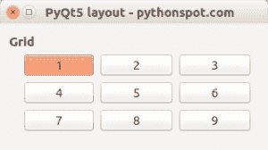

# PyQt5 网格布局

> 原文： [https://pythonspot.com/pyqt5-grid-layout/](https://pythonspot.com/pyqt5-grid-layout/)

[**PyQt5**](https://pythonspot.com/pyqt5/) 支持网格布局，其名称为 **QGridLayout** 。 可以在水平和垂直方向上将小部件添加到网格中。 带有小部件的网格布局示例如下所示：



## PyQt5 网格布局示例：

下面的示例创建网格：

```
import sys
from PyQt5.QtWidgets import QApplication, QWidget, QPushButton, QHBoxLayout, QGroupBox, QDialog, QVBoxLayout, QGridLayout
from PyQt5.QtGui import QIcon
from PyQt5.QtCore import pyqtSlot

class App(QDialog):

    def __init__(self):
        super().__init__()
        self.title = 'PyQt5 layout - pythonspot.com'
        self.left = 10
        self.top = 10
        self.width = 320
        self.height = 100
        self.initUI()

    def initUI(self):
        self.setWindowTitle(self.title)
        self.setGeometry(self.left, self.top, self.width, self.height)

        self.createGridLayout()

        windowLayout = QVBoxLayout()
        windowLayout.addWidget(self.horizontalGroupBox)
        self.setLayout(windowLayout)

        self.show()

    def createGridLayout(self):
        self.horizontalGroupBox = QGroupBox("Grid")
        layout = QGridLayout()
        layout.setColumnStretch(1, 4)
        layout.setColumnStretch(2, 4)

        layout.addWidget(QPushButton('1'),0,0)
        layout.addWidget(QPushButton('2'),0,1)
        layout.addWidget(QPushButton('3'),0,2)
        layout.addWidget(QPushButton('4'),1,0)
        layout.addWidget(QPushButton('5'),1,1)
        layout.addWidget(QPushButton('6'),1,2)
        layout.addWidget(QPushButton('7'),2,0)
        layout.addWidget(QPushButton('8'),2,1)
        layout.addWidget(QPushButton('9'),2,2)

        self.horizontalGroupBox.setLayout(layout)

if __name__ == '__main__':
    app = QApplication(sys.argv)
    ex = App()
    sys.exit(app.exec_())

```

**解释**

我们通过以下方式导入 gridlayout 和其他内容：

```
from PyQt5.QtWidgets import QApplication, QWidget, QPushButton, QHBoxLayout, QGroupBox, QDialog, QVBoxLayout, QGridLayout

```

在方法 createGridLayout（）中，我们创建带有标题的网格并设置大小。

```
def createGridLayout(self):
    self.horizontalGroupBox = QGroupBox("Grid")
    layout = QGridLayout()
    layout.setColumnStretch(1, 4)
    layout.setColumnStretch(2, 4)

```

使用添加小部件

```
layout.addWidget(Widget,X,Y)

```

最后，我们设置布局。

[下载 PyQT5 示例](https://pythonspot.com/download-pyqt5-examples/)