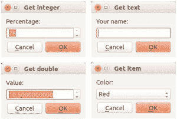

# PyQT5 输入对话框

> 原文： [https://pythonspot.com/pyqt5-input-dialog/](https://pythonspot.com/pyqt5-input-dialog/)

[**PyQt5**](https://pythonspot.com/pyqt5/) 支持多个输入对话框，使用它们可以导入 QInputDialog。

```py
from PyQt5.QtWidgets import QApplication, QWidget, QInputDialog, QLineEdit

```

[**PyQt5**](https://pythonspot.com/pyqt5/) 输入对话框概述：



## 获取整数

使用 QInputDialog.getInt（）获取整数：

```py
def getInteger(self):
    i, okPressed = QInputDialog.getInt(self, "Get integer","Percentage:", 28, 0, 100, 1)
    if okPressed:
        print(i)

```

参数顺序如下：自身，窗口标题，标签（在输入框之前），默认值，最小，最大和步长。

## 获得双倍

通过 QInputDialog.getDouble（）获得双倍：

```py
def getDouble(self):
    d, okPressed = QInputDialog.getDouble(self, "Get double","Value:", 10.05, 0, 100, 10)
    if okPressed:
        print(d)

```

最后一个参数（10）是逗号后面的小数位数。

## 获取项目/选择

从下拉框中获取一个项目：

```py
def getChoice(self):
    items = ("Red","Blue","Green")
    item, okPressed = QInputDialog.getItem(self, "Get item","Color:", items, 0, False)
    if okPressed and item:
        print(item)

```

## 获取字符串

使用 QInputDialog.getText（）获取字符串

```py
def getText(self):
    text, okPressed = QInputDialog.getText(self, "Get text","Your name:", QLineEdit.Normal, "")
    if okPressed and text != '':
        print(text)

```

## 所有 PyQt5 输入对话框的示例

下面的完整示例：

```py
import sys
from PyQt5.QtWidgets import QApplication, QWidget, QInputDialog, QLineEdit
from PyQt5.QtGui import QIcon

class App(QWidget):

    def __init__(self):
        super().__init__()
        self.title = 'PyQt5 input dialogs - pythonspot.com'
        self.left = 10
        self.top = 10
        self.width = 640
        self.height = 480
        self.initUI()

    def initUI(self):
        self.setWindowTitle(self.title)
        self.setGeometry(self.left, self.top, self.width, self.height)

        self.getInteger()
        self.getText()
        self.getDouble()
        self.getChoice()

        self.show()

    def getInteger(self):
        i, okPressed = QInputDialog.getInt(self, "Get integer","Percentage:", 28, 0, 100, 1)
        if okPressed:
            print(i)

    def getDouble(self):
        d, okPressed = QInputDialog.getDouble(self, "Get double","Value:", 10.50, 0, 100, 10)
        if okPressed:
            print( d)

    def getChoice(self):
        items = ("Red","Blue","Green")
        item, okPressed = QInputDialog.getItem(self, "Get item","Color:", items, 0, False)
        if ok and item:
            print(item)

    def getText(self):
        text, okPressed = QInputDialog.getText(self, "Get text","Your name:", QLineEdit.Normal, "")
        if okPressed and text != '':
            print(text)

if __name__ == '__main__':
    app = QApplication(sys.argv)
    ex = App()
    sys.exit(app.exec_())

```

[下载 PyQT5 示例](https://pythonspot.com/download-pyqt5-examples/)