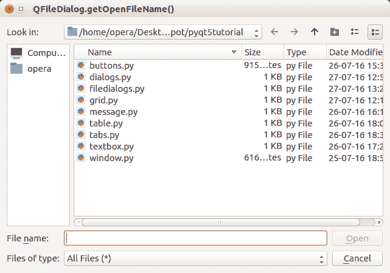

# PyQt5 文件对话框

> 原文： [https://pythonspot.com/pyqt5-file-dialog/](https://pythonspot.com/pyqt5-file-dialog/)

[**PyQt5**](https://pythonspot.com/pyqt5/) 支持（本机）文件对话框：打开文件，打开文件和保存文件。 通过调用 PyQt5 中包含的功能，您将获得默认的文件对话框，而无需从头开始重新创建这些对话框。

需要导入 **QFileDialog** 。

## 文件对话框示例

使用的方法是 QFileDialog.getOpenFileName（），QFileDialog.getOpenFileNames（），QFileDialog.getSaveFileName（）。 使用方法参数可以指定默认目录，文件类型和默认文件名。



下面的代码将显示所有文件对话框：

```
import sys
from PyQt5.QtWidgets import QApplication, QWidget, QInputDialog, QLineEdit, QFileDialog
from PyQt5.QtGui import QIcon

class App(QWidget):

    def __init__(self):
        super().__init__()
        self.title = 'PyQt5 file dialogs - pythonspot.com'
        self.left = 10
        self.top = 10
        self.width = 640
        self.height = 480
        self.initUI()

    def initUI(self):
        self.setWindowTitle(self.title)
        self.setGeometry(self.left, self.top, self.width, self.height)

        self.openFileNameDialog()
        self.openFileNamesDialog()
        self.saveFileDialog()

        self.show()

    def openFileNameDialog(self):
        options = QFileDialog.Options()
        options |= QFileDialog.DontUseNativeDialog
        fileName, _ = QFileDialog.getOpenFileName(self,"QFileDialog.getOpenFileName()", "","All Files (*);;Python Files (*.py)", options=options)
        if fileName:
            print(fileName)

    def openFileNamesDialog(self):
        options = QFileDialog.Options()
        options |= QFileDialog.DontUseNativeDialog
        files, _ = QFileDialog.getOpenFileNames(self,"QFileDialog.getOpenFileNames()", "","All Files (*);;Python Files (*.py)", options=options)
        if files:
            print(files)

    def saveFileDialog(self):
        options = QFileDialog.Options()
        options |= QFileDialog.DontUseNativeDialog
        fileName, _ = QFileDialog.getSaveFileName(self,"QFileDialog.getSaveFileName()","","All Files (*);;Text Files (*.txt)", options=options)
        if fileName:
            print(fileName)

if __name__ == '__main__':
    app = QApplication(sys.argv)
    ex = App()
    sys.exit(app.exec_())

```

[下载 PyQT5 示例](https://pythonspot.com/download-pyqt5-examples/)