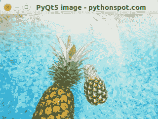

# PyQt5 图像

> 原文： [https://pythonspot.com/pyqt5-image/](https://pythonspot.com/pyqt5-image/)

PyQt5（和 Qt）默认情况下支持图像。 在本文中，我们将向您展示如何向窗口添加图像。 可以使用`QPixmap`类加载图像。

## PyQt5 图像简介

将图像添加到 [PyQt5](https://pythonspot.com/pyqt5/) 窗口就像创建标签并将图像添加到该标签一样简单。

```py
label = QLabel(self)
pixmap = QPixmap('image.jpeg')
label.setPixmap(pixmap)

# Optional, resize window to image size
self.resize(pixmap.width(),pixmap.height())

```

这些是必需的导入：

```py
from PyQt5.QtWidgets import QApplication, QWidget, QLabel
from PyQt5.QtGui import QIcon, QPixmap

```



## PyQt5 加载图像（`QPixmap`）

复制下面的代码并运行。 该映像应与程序位于同一目录中。

```py
import sys
from PyQt5.QtWidgets import QApplication, QWidget, QLabel
from PyQt5.QtGui import QIcon, QPixmap

class App(QWidget):

    def __init__(self):
        super().__init__()
        self.title = 'PyQt5 image - pythonspot.com'
        self.left = 10
        self.top = 10
        self.width = 640
        self.height = 480
        self.initUI()

    def initUI(self):
        self.setWindowTitle(self.title)
        self.setGeometry(self.left, self.top, self.width, self.height)

        # Create widget
        label = QLabel(self)
        pixmap = QPixmap('image.jpeg')
        label.setPixmap(pixmap)
        self.resize(pixmap.width(),pixmap.height())

        self.show()

if __name__ == '__main__':
    app = QApplication(sys.argv)
    ex = App()
    sys.exit(app.exec_())

```

[下载 PyQT5 示例](https://pythonspot.com/download-pyqt5-examples/)