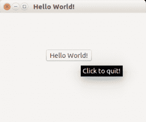

# Qt4 按钮

> 原文： [https://pythonspot.com/qt4-buttons/](https://pythonspot.com/qt4-buttons/)



PyQt4 按钮示例

PyQt4（Qt4）通过 QPushButton 小部件支持按钮。

我们扩展代码以在窗口中心显示一个按钮。

如果将鼠标悬停在该按钮上将显示一个工具提示，按下该按钮将关闭程序。

## PyQt4 按钮示例

下面的示例在 PyQt4 窗口中添加了一个按钮。

```py
#! /usr/bin/env python
# -*- coding: utf-8 -*-
#
import sys
from PyQt4.QtGui import *

# Create an PyQT4 application object.
a = QApplication(sys.argv)

# The QWidget widget is the base class of all user interface objects in PyQt4.
w = QWidget()

# Set window size.
w.resize(320, 240)

# Set window title
w.setWindowTitle("Hello World!")

# Add a button
btn = QPushButton('Hello World!', w)
btn.setToolTip('Click to quit!')
btn.clicked.connect(exit)
btn.resize(btn.sizeHint())
btn.move(100, 80)

# Show window
w.show()

sys.exit(a.exec_())

```

## PyQt4 信号和插槽

单击按钮应该可以执行某些操作。 为此，您必须使用信号和插槽。

如果用户执行诸如单击按钮，在框中键入文本之类的操作，则小部件会发出信号。 信号可以与一个插槽相连，该插槽充当接收器并对其起作用。

```py
import sys
from PyQt4.QtCore import pyqtSlot
from PyQt4.QtGui import *

# create our window
app = QApplication(sys.argv)
w = QWidget()
w.setWindowTitle('Button click example @pythonspot.com')

# Create a button in the window
btn = QPushButton('Click me', w)

# Create the actions
@pyqtSlot()
def on_click():
    print('clicked')

@pyqtSlot()
def on_press():
    print('pressed')

@pyqtSlot()
def on_release():
    print('released')

# connect the signals to the slots
btn.clicked.connect(on_click)
btn.pressed.connect(on_press)
btn.released.connect(on_release)

# Show the window and run the app
w.show()
app.exec_()

```

[下载 PyQT 代码（批量收集）](https://pythonspot.com/python-qt-examples/)