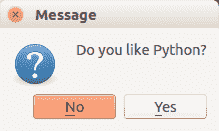
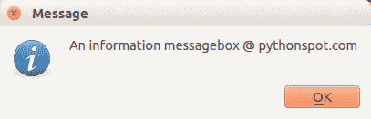
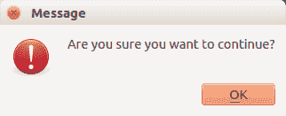
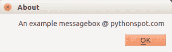

# QT4 消息框

> 原文： [https://pythonspot.com/qt4-messagebox/](https://pythonspot.com/qt4-messagebox/)

[PyQT4](https://pythonspot.com/pyqt4/) 使用多种功能提供消息框功能。 [PyQT4](https://pythonspot.com/pyqt4/) 中包含的 消息框是：问题，警告，错误，信息，批评和关于框。

## PyQt4 消息框

The code below will display a message box with two buttons:

```
#! /usr/bin/env python
# -*- coding: utf-8 -*-
#
import sys
from PyQt4.QtGui import *

# Create an PyQT4 application object.
a = QApplication(sys.argv)

# The QWidget widget is the base class of all user interface objects in PyQt4.
w = QWidget()

# Show a message box
result = QMessageBox.question(w, 'Message', "Do you like Python?", QMessageBox.Yes | QMessageBox.No, QMessageBox.No)

if result == QMessageBox.Yes:
    print('Yes.')
else:
    print('No.')

# Show window
w.show()

sys.exit(a.exec_())

```

结果：

 qtMessagebox question

[PyQT4](https://pythonspot.com/pyqt4/) 提供了不同类型的消息框。

## PyQT4 警告框

You can display a warning box using this line of code:

```
QMessageBox.warning(w, "Message", "Are you sure you want to continue?")

```

## PyQT4 信息框

We can display an information box using QMessageBox.information()

```
QMessageBox.information(w, "Message", "An information messagebox @ pythonspot.com ")

```

结果：

 QMessageBox Info

## PyQT4 临界盒

If something goes wrong in your application you may want to display an error message.

```
QMessageBox.critical(w, "Message", "No disk space left on device.")

```

Result:  QMessagebox

## PyQT4 关于盒子

We have shown the question box above.

```
QMessageBox.about(w, "About", "An example messagebox @ pythonspot.com ")

```

Result:  qt Messagebox

[下载 PyQT 代码（批量收集）](https://pythonspot.com/python-qt-examples/)