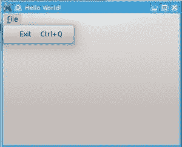

# PyQt4 的菜单

> 原文： [https://pythonspot.com/qt4-menu/](https://pythonspot.com/qt4-menu/)



PyQT 菜单

[**PyQt4**](https://pythonspot.com/pyqt4/) **菜单**出现在窗口栏的顶部。 **菜单**使用户可以控制应用程序，并且通常位于窗口顶部。

QMainWindow 类创建主应用程序窗口。 此类具有一个名为 menuBar（）的方法，该方法添加标题栏。

可以使用 addMenu（）将菜单添加到标题栏。 在每个菜单内，您都可以使用 addAction 方法添加命令。

## PyQt4 菜单栏

此代码将为您的 qt4 应用添加菜单：

```py
#! /usr/bin/env python
# -*- coding: utf-8 -*-
#
import sys
from PyQt4.QtGui import *

# Create an PyQT4 application object.
a = QApplication(sys.argv)

# The QWidget widget is the base class of all user interface objects in PyQt4.
w = QMainWindow()

# Set window size.
w.resize(320, 240)

# Set window title
w.setWindowTitle("Hello World!")

# Create main menu
mainMenu = w.menuBar()
mainMenu.setNativeMenuBar(False)
fileMenu = mainMenu.addMenu('&amp;File')

# Add exit button
exitButton = QAction(QIcon('exit24.png'), 'Exit', w)
exitButton.setShortcut('Ctrl+Q')
exitButton.setStatusTip('Exit application')
exitButton.triggered.connect(w.close)
fileMenu.addAction(exitButton)

# Show window
w.show()

sys.exit(a.exec_())

```

[下载 PyQT 代码（批量收集）](https://pythonspot.com/python-qt-examples/)