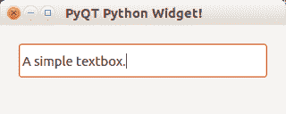
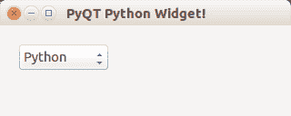
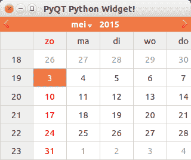

# QT4 小部件

> 原文： [https://pythonspot.com/qt4-widgets/](https://pythonspot.com/qt4-widgets/)

我们有许多可通过 [PyQT](https://pythonspot.com/pyqt4/) 访问的小部件。 其中包括：

*   文本框
*   组合框
*   日历

For more widgets we suggest using the GUI creation tool covered in the next tutorial.

**文本框小部件** 几乎每个应用程序中都存在输入字段。 在 [PyQT4](https://pythonspot.com/pyqt4/) 中，可以使用 QLineEdit（）函数创建输入字段。

```
#! /usr/bin/env python
# -*- coding: utf-8 -*-
#
import sys
from PyQt4.QtGui import *

# Create an PyQT4 application object.
a = QApplication(sys.argv)

# The QWidget widget is the base class of all user interface objects in PyQt4.
w = QMainWindow()

# Set window size.
w.resize(320, 100)

# Set window title
w.setWindowTitle("PyQT Python Widget!")

# Create textbox
textbox = QLineEdit(w)
textbox.move(20, 20)
textbox.resize(280,40)

# Show window
w.show()

sys.exit(a.exec_())

```

 qt textbox

**组合框** 组合框可用于从列表中选择一个项目。

```
#! /usr/bin/env python
# -*- coding: utf-8 -*-
#
import sys
from PyQt4.QtGui import *

# Create an PyQT4 application object.
a = QApplication(sys.argv)

# The QWidget widget is the base class of all user interface objects in PyQt4.
w = QMainWindow()

# Set window size.
w.resize(320, 100)

# Set window title
w.setWindowTitle("PyQT Python Widget!")

# Create combobox
combo = QComboBox(w)
combo.addItem("Python")
combo.addItem("Perl")
combo.addItem("Java")
combo.addItem("C++")
combo.move(20,20)

# Show window
w.show()

sys.exit(a.exec_())

```

 qt combobox

**日历小部件** PyQT4 库有一个日历小部件，您可以使用 QCalendarWidget（）调用来创建它。

```
#! /usr/bin/env python
# -*- coding: utf-8 -*-
#
import sys
from PyQt4.QtGui import *

# Create an PyQT4 application object.
a = QApplication(sys.argv)

# The QWidget widget is the base class of all user interface objects in PyQt4.
w = QMainWindow()

# Set window size.
w.resize(320, 240)

# Set window title
w.setWindowTitle("PyQT Python Widget!")

# Create calendar
cal = QCalendarWidget(w)
cal.setGridVisible(True)
cal.move(0, 0)
cal.resize(320,240)

# Show window
w.show()

sys.exit(a.exec_())

```

结果：

 calendar qt

[下载 PyQT 代码（批量收集）](https://pythonspot.com/python-qt-examples/)