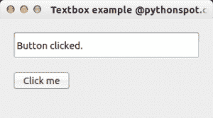

# PyQt4 文本框

> 原文： [https://pythonspot.com/qt4-textbox-example/](https://pythonspot.com/qt4-textbox-example/)

 PyQt4 textbox example

在本文中，您将学习如何使用 [PyQt4](https://pythonspot.com/pyqt4/) 与文本框进行交互。

如果要在文本框（QLineEdit）中显示文本，则可以使用 setText（）方法。

## PyQt4 QLineEdit

The textbox example below changes the text if the button is pressed.

```
import sys
from PyQt4.QtCore import pyqtSlot
from PyQt4.QtGui import *

# create our window
app = QApplication(sys.argv)
w = QWidget()
w.setWindowTitle('Textbox example @pythonspot.com')

# Create textbox
textbox = QLineEdit(w)
textbox.move(20, 20)
textbox.resize(280,40)

# Set window size.
w.resize(320, 150)

# Create a button in the window
button = QPushButton('Click me', w)
button.move(20,80)

# Create the actions
@pyqtSlot()
def on_click():
    textbox.setText("Button clicked.")

# connect the signals to the slots
button.clicked.connect(on_click)

# Show the window and run the app
w.show()
app.exec_()

```

使用以下行创建文本字段：

```
textbox = QLineEdit(w)
textbox.move(20, 20)
textbox.resize(280,40)

```

该按钮（来自屏幕截图）由以下部分制成：

```
button = QPushButton('Click me', w)

```

我们通过以下方式将按钮连接到 on_click 函数：

```
# connect the signals to the slots
button.clicked.connect(on_click)

```

此函数使用 setText（）设置文本框。

[下载 PyQT 代码（批量收集）](https://pythonspot.com/python-qt-examples/)