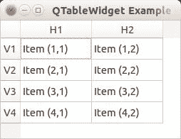
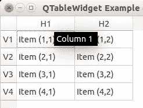

# QT4 表

> 原文： [https://pythonspot.com/qt4-table/](https://pythonspot.com/qt4-table/)

我们可以使用 QTableWidget 来显示表格，QTableWidget 是 [PyQt](https://pythonspot.com/pyqt4/) 模块的一部分。 我们设置标题，行数，列数并添加数据。

**相关课程：**

*   [使用 PyQt5 创建 GUI 应用](https://gum.co/pysqtsamples)

## Qt4 表示例

An example below:

```
from PyQt4.QtGui import *
from PyQt4.QtCore import *
import sys

def main():
    app 	= QApplication(sys.argv)
    table 	= QTableWidget()
    tableItem 	= QTableWidgetItem()

    # initiate table
    table.setWindowTitle("QTableWidget Example @pythonspot.com")
    table.resize(400, 250)
    table.setRowCount(4)
    table.setColumnCount(2)

    # set data
    table.setItem(0,0, QTableWidgetItem("Item (1,1)"))
    table.setItem(0,1, QTableWidgetItem("Item (1,2)"))
    table.setItem(1,0, QTableWidgetItem("Item (2,1)"))
    table.setItem(1,1, QTableWidgetItem("Item (2,2)"))
    table.setItem(2,0, QTableWidgetItem("Item (3,1)"))
    table.setItem(2,1, QTableWidgetItem("Item (3,2)"))
    table.setItem(3,0, QTableWidgetItem("Item (4,1)"))
    table.setItem(3,1, QTableWidgetItem("Item (4,2)"))

    # show table
    table.show()
    return app.exec_()

if __name__ == '__main__':
    main()

```

结果：

   [PyQT](https://pythonspot.com/pyqt4/) Table tooltips

[下载 PyQT 代码（批量收集）](https://pythonspot.com/python-qt-examples/)