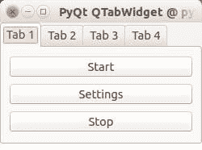

# QT4 标签

> 原文： [https://pythonspot.com/qt4-tabs/](https://pythonspot.com/qt4-tabs/)

选项卡在图形应用程序中非常有用。 它们出现在网络浏览器，文本编辑器和任何其他应用中。 要创建选项卡式窗口，您需要调用 QTabWidget（）函数。 每个选项卡都是您之前看到的 QWidget（）。 您可以使用以下功能将 QWidget 与 QTabWidget 连接：

```py
tabs.addTab(tab1,"Tab 1")

```

其中第一个参数是选项卡对象，第二个参数是显示在屏幕上的名称。 我们在第一个标签（QWidget）中添加了一些按钮。

**示例代码：**

```py
from PyQt4 import QtGui
from PyQt4 import QtCore
import sys

def main():

    app 	= QtGui.QApplication(sys.argv)
    tabs	= QtGui.QTabWidget()

    # Create tabs
    tab1	= QtGui.QWidget()
    tab2	= QtGui.QWidget()
    tab3	= QtGui.QWidget()
    tab4	= QtGui.QWidget()

    # Resize width and height
    tabs.resize(250, 150)

    # Set layout of first tab
    vBoxlayout	= QtGui.QVBoxLayout()
    pushButton1 = QtGui.QPushButton("Start")
    pushButton2 = QtGui.QPushButton("Settings")
    pushButton3 = QtGui.QPushButton("Stop")
    vBoxlayout.addWidget(pushButton1)
    vBoxlayout.addWidget(pushButton2)
    vBoxlayout.addWidget(pushButton3)
    tab1.setLayout(vBoxlayout)

    # Add tabs
    tabs.addTab(tab1,"Tab 1")
    tabs.addTab(tab2,"Tab 2")
    tabs.addTab(tab3,"Tab 3")
    tabs.addTab(tab4,"Tab 4")

    # Set title and show
    tabs.setWindowTitle('PyQt QTabWidget @ pythonspot.com')
    tabs.show()

    sys.exit(app.exec_())

if __name__ == '__main__':
    main()

```

结果：



PyQT Tabs

[下载 PyQT 代码（批量收集）](https://pythonspot.com/python-qt-examples/)