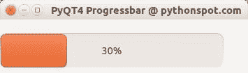

# QT4 进度条

> 原文： [https://pythonspot.com/qt4-progressbar/](https://pythonspot.com/qt4-progressbar/)

在本文中，我们将演示如何使用 progressbar 小部件。 进度条与其他小部件的不同之处在于，它会及时更新。

## QT4 进度条示例

让我们从代码开始：

```py
#! /usr/bin/env python
# -*- coding: utf-8 -*-
#
import sys
from PyQt4.QtGui import *
from PyQt4.QtCore import *
from PyQt4.QtCore import pyqtSlot,SIGNAL,SLOT

class QProgBar(QProgressBar):

    value = 0

    @pyqtSlot()
    def increaseValue(progressBar):
        progressBar.setValue(progressBar.value)
        progressBar.value = progressBar.value+1

# Create an PyQT4 application object.
a = QApplication(sys.argv)

# The QWidget widget is the base class of all user interface objects in PyQt4.
w = QWidget()

# Set window size.
w.resize(320, 240)

# Set window title
w.setWindowTitle("PyQT4 Progressbar @ pythonspot.com ")

# Create progressBar.
bar = QProgBar(w)
bar.resize(320,50)
bar.setValue(0)
bar.move(0,20)

# create timer for progressBar
timer = QTimer()
bar.connect(timer,SIGNAL("timeout()"),bar,SLOT("increaseValue()"))
timer.start(400)

# Show window
w.show()

sys.exit(a.exec_())

```

实例栏（QProgBar 类的）用于保存进度条的值。 我们调用函数 setValue（）来更新其值。 给定参数 w 将其附加到主窗口。 然后，将其移动到屏幕上的位置（0,20），并为其指定宽度和高度。

为了及时更新进度条，我们需要一个 QTimer（）。 我们将小部件与计时器连接起来，计时器将调用函数 gainValue（）。 我们将计时器设置为每 400 毫秒重复一次函数调用。 您还会看到单词 SLOT 和 SIGNAL。 如果用户执行诸如单击按钮，在框中键入文本之类的操作，则该小部件会发出信号。 该信号没有任何作用，但可用于连接一个槽，该槽充当接收器并对其起作用。

结果：



PyQT 进度条

[下载 PyQT 代码（批量收集）](https://pythonspot.com/python-qt-examples/)