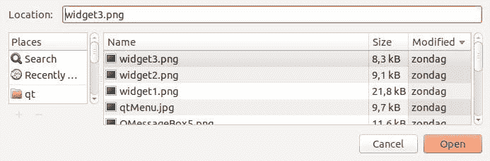

# QT4 文件对话框

> 原文： [https://pythonspot.com/qt4-file-dialog/](https://pythonspot.com/qt4-file-dialog/)

在这个简短的教程中，您将学习如何创建文件对话框并加载其文件内容。 使用文件访问的许多应用程序都需要文件对话框。

## 文件对话框示例

要在 [PyQT](https://pythonspot.com/pyqt4/) 中获取文件名（而非文件数据），可以使用以下行：

```
filename = QFileDialog.getOpenFileName(w, 'Open File', '/')

```

如果您使用的是 Microsoft Windows，请使用

```
filename = QFileDialog.getOpenFileName(w, 'Open File', 'C:\')

```

下面的示例（包括加载文件数据）：

```
#! /usr/bin/env python
# -*- coding: utf-8 -*-
#
import sys
from PyQt4.QtGui import *

# Create an PyQT4 application object.
a = QApplication(sys.argv)

# The QWidget widget is the base class of all user interface objects in PyQt4.
w = QWidget()

# Set window size.
w.resize(320, 240)

# Set window title
w.setWindowTitle("Hello World!")

# Get filename using QFileDialog
filename = QFileDialog.getOpenFileName(w, 'Open File', '/')
print(filename)

# print file contents
with open(filename, 'r') as f:
    print(f.read())

# Show window
w.show()

sys.exit(a.exec_())

```

结果（输出可能因您的操作系统而异）：



PyQt File Open Dialog.

[下载 PyQT 代码（批量收集）](https://pythonspot.com/python-qt-examples/)