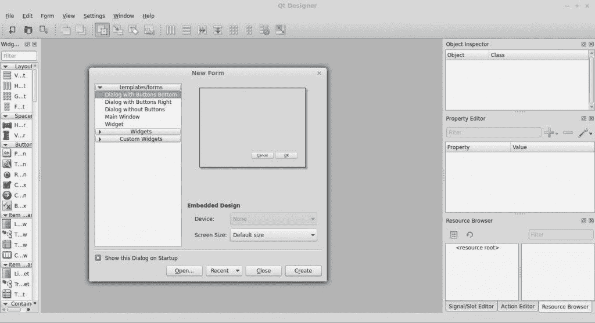
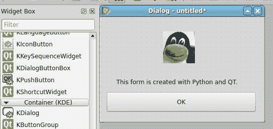
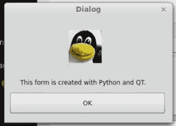
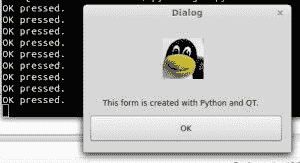

# PyQt4 GUI 教程

> 原文： [https://pythonspot.com/building-an-application-gui-with-pyqt-beginners-tutorial/](https://pythonspot.com/building-an-application-gui-with-pyqt-beginners-tutorial/)

在本教程中，我们将教您如何使用 [PyQT4](https://pythonspot.com/pyqt4/) 创建图形应用程序。 这可以在支持 [PyQT4](https://pythonspot.com/pyqt4/) 的任何平台上使用，包括 Windows，Linux，UNIX，Android，OS X 和 iOS。

## PyQt4 安装

PyQt does not include Qt itself – you may have to obtain it separately. The homepage for PyQt is [https://www.riverbankcomputing.com/software/pyqt/](https://www.riverbankcomputing.com/software/pyqt/).

您将需要安装一些软件包：

```py
sudo pip install pyqt
sudo apt-get install qt4-designer
sudo apt-get install pyqt4-dev-tools
sudo apt-get install python-kde4

```

如果找不到 python-kde4，请更新您的存储库以找到它。 如果您使用的是 Ubuntu，请使用此链接。

## 构建一个 PyQT4 GUI

Now we can use the QT Designer application. It saves us from writing tons of layout code that you may be used to when writing HTML. Start qt4-designer from your applications menu. The QT Designer application will appear.

QT Designer

按不带按钮的对话框，然后按创建。 现在，您可以将任何组件从窗口小部件框拖动到表单。 简单的拖放。 我们添加了一个按钮，标签和一个像素图。 （我从网上拍摄了一张随机图作为像素图）



QT KDE Dialog

我们的窗口如上图所示。 按 Form &gt; Viewcode。 我们将在 C ++中得到一个带有表单代码的弹出框！ 很好，但是我们需要 Python 代码。 按文件&gt;另存为&gt;form.ui。

文件 test.ui 包含以 XML 格式描述的表单。 （您可以在文本编辑器中查看它）打开控制台并键入：

```py
pyuic4 form.ui > form.py

```

运行文件没有任何作用。 创建一个名为 gui.py 的新文件

粘贴以下代码：

```py
import sys
from PyQt4 import QtCore, QtGui
from form import Ui_Dialog

class MyDialog(QtGui.QDialog):
    def __init__(self, parent=None):
        QtGui.QWidget.__init__(self, parent)
        self.ui = Ui_Dialog()
        self.ui.setupUi(self)

if __name__ == "__main__":
    app = QtGui.QApplication(sys.argv)
    myapp = MyDialog()
    myapp.show()
    sys.exit(app.exec_())

```

运行：

```py
python gui.py

```

这将打开我们的图形界面。 按下“确定”按钮将仅关闭该应用程序。



[PyQt](https://pythonspot.com/pyqt4/) Window with QButton

我们想在按下 OK 按钮时添加一些动作。 我们将以下三行添加到代码中：

```py
self.ui.pushButton.clicked.connect(self.OK)

def OK(self):
    print 'OK pressed.'

```



[pyqt4](https://pythonspot.com/pyqt4/) app example

[下载 PyQT4 示例（批量收集）](https://pythonspot.com/python-qt-examples/)

您可能会喜欢：[使用 PyQT4](https://pythonspot.com/creating-a-webbrowser-with-python-and-pyqt-tutorial/) 或[创建 Web 浏览器 PyQt4 概述](https://pythonspot.com/pyqt4/)