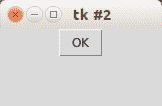
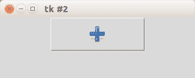
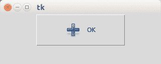

# Tk 窗口和按钮

> 原文： [https://pythonspot.com/tk-window-and-button/](https://pythonspot.com/tk-window-and-button/)

带有 onClick 事件的 **Tk 按钮** 

要创建带有按钮的 [**Tkinter**](https://pythonspot.com/tkinter/) 窗口，请使用以下示例。 程序进入 mainloop（），等待事件（用户操作）。 我们定义具有回调函数 callback（）的按钮。 master 是根窗口，您的按钮将出现在该窗口中。

```py
from Tkinter import *

master = Tk()

def callback():
    print "click!"

b = Button(master, text="OK", command=callback)
b.pack()

mainloop()

```



tk 按钮

## Tk 图像按钮

如果需要图像按钮，请使用 PhotoImage 类。 我们使用函数 minsize（）和 geometry（）设置窗口的大小和最小大小。 例：

```py
from Tkinter import *

master = Tk()
master.minsize(300,100)
master.geometry("320x100")

def callback():
    print "click!"

photo=PhotoImage(file="add.png")
b = Button(master,image=photo, command=callback, height=50, width=150)
b.pack()

mainloop()

```

结果：



tk 图像按钮

## 带有文本标签的 Tk 图像按钮

如果需要图像和文本，只需添加参数 compound = LEFT。

```py
from Tkinter import *

master = Tk()
master.minsize(300,100)
master.geometry("320x100")

def callback():
    print "click!"

photo=PhotoImage(file="add.png")
b = Button(master,image=photo, text="OK", command=callback, height=50, width=150, compound=LEFT)
b.pack()

mainloop()

```

结果：



带有图像和文本的 tk 按钮

## 按钮位置

如果要将按钮放置在坐标上，请不要使用 pack（）函数，而要使用 place（x，y）函数，如下例所示：

```py
from Tkinter import *

master = Tk()
master.minsize(300,100)
master.geometry("320x100")

def callback():
    print "click!"

photo=PhotoImage(file="add.png")
b = Button(master,image=photo, text="OK", command=callback, height=50, width=150, compound=LEFT)
b.place(x = 20, y = 20)

mainloop()

```

结果：


tk 按钮位置 

[下载 tkinter 示例](/download-tkinter-examples)