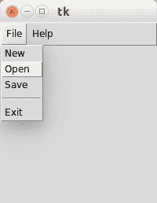

# Tk 菜单栏

> 原文： [https://pythonspot.com/tk-menubar/](https://pythonspot.com/tk-menubar/)

Tkinter 工具箱包含所有用于创建图形应用程序的基本小部件。 几乎每个应用程序都有一个主菜单。 与预期的一样，Tkinter 支持将主菜单添加到您的应用程序窗口。

下面的屏幕截图演示了基于 Tkinter 的菜单：

 Tkinter menu

**相关课程**

*   [带有 Tkinter 的 Python 桌面应用](https://gum.co/ErLc)

## Tkinter 菜单栏

You can create a simle menu with [Tkinter](https://pythonspot.com/tkinter/) using the code below. Every option (new, open, save.. ) should have its own callback.

```
from Tkinter import *

def donothing():
   x = 0

root = Tk()

menubar = Menu(root)
filemenu = Menu(menubar, tearoff=0)
filemenu.add_command(label="New", command=donothing)
filemenu.add_command(label="Open", command=donothing)
filemenu.add_command(label="Save", command=donothing)
filemenu.add_separator()
filemenu.add_command(label="Exit", command=root.quit)
menubar.add_cascade(label="File", menu=filemenu)

helpmenu = Menu(menubar, tearoff=0)
helpmenu.add_command(label="Help Index", command=donothing)
helpmenu.add_command(label="About...", command=donothing)
menubar.add_cascade(label="Help", menu=helpmenu)

root.config(menu=menubar)
root.mainloop()

```

我们通过调用创建菜单栏：

```
menubar = Menu(root)

```

其中 root 是 Tk（）对象。

菜单栏可能包含零个或多个子菜单，例如文件菜单，编辑菜单，视图菜单，工具菜单等。

可以使用相同的 Menu（）调用创建子菜单，其中第一个参数是要附加到的菜单栏。

```
filemenu = Menu(menubar, tearoff=0)
menu = Menu(menubar, tearoff=0)

```

可以使用 add_command（）方法将各个选项添加到这些子菜单中：

```
filemenu.add_command(label="New", command=donothing)
filemenu.add_command(label="Open", command=donothing)
filemenu.add_command(label="Save", command=donothing)

```

在该示例中，我们创建了回调函数 donothing（）并将每个命令链接到它以简化操作。 使用 add_comment（）函数添加一个选项。 我们调用 add_cascade（）将此菜单列表添加到特定列表。

[下载 tkinter 示例](/download-tkinter-examples)