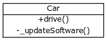
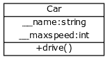

# 封装形式

> 原文： [https://pythonspot.com/encapsulation](https://pythonspot.com/encapsulation)

在面向对象的 python 程序中，您可以 _ 限制对方法和变量的访问 _。 这可以防止意外修改数据，这就是 _ 封装 _。 让我们从一个例子开始。

## 私人方法



encapsulation. Restricted accesss to methods or variables

我们创建了一个 Car 类，它具有两种方法：drive（）和 updateSoftware（）。 创建汽车对象时，它将调用私有方法 __updateSoftware（）。

仅在类内部不能直接在对象上调用此函数。

```py
#!/usr/bin/env python

class Car:

    def __init__(self):
        self.__updateSoftware()

    def drive(self):
        print('driving')

    def __updateSoftware(self):
        print('updating software')

redcar = Car()
redcar.drive()
#redcar.__updateSoftware()  not accesible from object.

```

该程序将输出：

```py
updating software
driving

```

封装可以防止意外访问，但不是有意访问。

私有属性和方法并未真正隐藏，而是在其名称的开头加上了 _Car”来重命名。

实际上可以使用 redcar._Car__updateSoftware（）调用该方法。

## 私人变量



Class with private variables

变量可以是私有的，这在许多情况下都可以使用。 私有变量只能在类方法内更改，而不能在类外部更改。

对象可以为您的应用程序保存关键数据，并且您不希望这些数据在代码中的任何位置都可以更改。
示例：

```py
#!/usr/bin/env python

class Car:

    __maxspeed = 0
    __name = ""

    def __init__(self):
        self.__maxspeed = 200
        self.__name = "Supercar"

    def drive(self):
        print('driving. maxspeed ' + str(self.__maxspeed))

redcar = Car()
redcar.drive()
redcar.__maxspeed = 10  # will not change variable because its private
redcar.drive()

```

如果要更改私有变量的值，则使用 setter 方法。 这只是设置私有变量值的一种方法。

```py
#!/usr/bin/env python

class Car:

    __maxspeed = 0
    __name = ""

    def __init__(self):
        self.__maxspeed = 200
        self.__name = "Supercar"

    def drive(self):
        print('driving. maxspeed ' + str(self.__maxspeed))

    def setMaxSpeed(self,speed):
        self.__maxspeed = speed

redcar = Car()
redcar.drive()
redcar.setMaxSpeed(320)
redcar.drive()

```

为什么要创建它们？ 因为某些私有值可能需要在创建对象后更改，而其他私有值可能根本不需要更改。

## Python 封装

To summarize, in Python there are:

Other programming languages have protected class methods too, but Python does not.

封装使您可以更好地控制代码中的耦合程度，它允许类在不影响代码其他部分的情况下更改其实现。

[下载练习](https://pythonspot.com/download-oop-exercises/)

| 类型 | 描述 |
| --- | --- |
| 公开方法 | 可从任何地方访问 |
| 私人方法 | 仅在自己的课程中可访问。 以两个下划线开头 |
| 公共变量 | 可从任何地方访问 |
| 私人变量 | 仅在自己的类或方法（如果已定义）中可访问。 以两个下划线开头 |