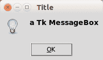
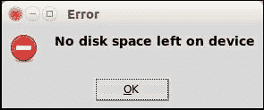

# TkInter 消息框

> 原文： [https://pythonspot.com/tk-message-box/](https://pythonspot.com/tk-message-box/)

[**Tkinter**](https://pythonspot.com/tkinter/) tkMessageBox 具有多种显示**消息框**的方法。

适用于 Python 2.7 的 [**Tkinter**](https://pythonspot.com/tkinter/) 和 Python 3 之间略有不同。 要找到您的 Python 版本，请尝试以下命令之一：

```
python --version
python3 --version

```

**相关课程**

*   [带有 Tkinter 的 Python 桌面应用](https://gum.co/ErLc)

### Tkinter 消息框

 TkMessage boxTo show a minimalistic  Tk messagebox dialog

Tkinter 包括其他几个消息框：

*   showerror（）
*   showwarning（）
*   showinfo（）

&lt;u&gt;Python 3.x&lt;/u&gt;

```
import tkinter
from tkinter import messagebox

# hide main window
root = tkinter.Tk()
root.withdraw()

# message box display
messagebox.showerror("Error", "Error message")
messagebox.showwarning("Warning","Warning message")
messagebox.showinfo("Information","Informative message")

```

&lt;u&gt;Python 2.7&lt;/u&gt;

```
import Tkinter
import tkMessageBox

# An error box
tkMessageBox.showerror("Error","No disk space left on device")

# A warning box 
tkMessageBox.showwarning("Warning","Could not start service")

# An information box
tkMessageBox.showinfo("Information","Created in Python.")

```

您可能会喜欢： [Tkinter 问题对话框](https://pythonspot.com/tkinter-askquestion-dialog/)或[更多 Tkinter](https://pythonspot.com/tkinter/)

[下载 tkinter 示例](/download-tkinter-examples)