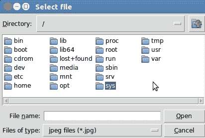
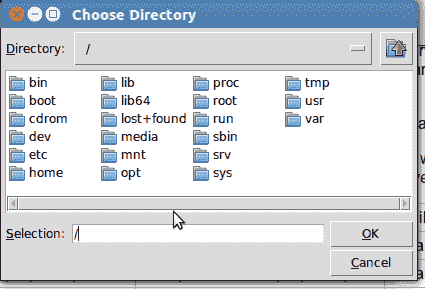

# Tkinter tkFileDialog 模块

> 原文： [https://pythonspot.com/tk-file-dialogs/](https://pythonspot.com/tk-file-dialogs/)

`tkFileDialog`是具有打开和保存对话框功能的模块。 无需自己在 [Tkinter GUI](https://pythonspot.com/tkinter/) 中实现。

## 概述

文件对话框的概述：

## Tkinter 打开文件

`askopenfilename`函数创建文件对话框对象。 扩展名显示在表格的底部（文件类型）。 下面的代码将仅显示对话框并返回文件名。 如果用户按下取消，则文件名为空。 在 Windows 计算机上，将 initialdir 更改为“ C：\”。

**Python 2.7 版本：**

| 功能 | 参量 | 目的 |
| --- | --- | --- |
| .askopenfilename | 目录，标题，扩展名 | 要**打开**文件：要求选择现有文件的对话框。 |
| .asksaveas 文件名 | 目录，标题，扩展名） | 要**保存**文件：要求创建或替换文件的对话框。 |
| .ask 目录 | 没有 | 到**打开目录** |

| 

```
from Tkinter import *from Tkinter import *
import Tkinter, Tkconstants, tkFileDialog

root = Tk()
root.filename = tkFileDialog.askopenfilename(initialdir = "/",title = "Select file",filetypes = (("jpeg files","*.jpg"),("all files","*.*")))
print (root.filename)

```

 |

**Python 3 版本：**

```
from tkinter import filedialog
from tkinter import *

root = Tk()
root.filename =  filedialog.askopenfilename(initialdir = "/",title = "Select file",filetypes = (("jpeg files","*.jpg"),("all files","*.*")))
print (root.filename)

```

这是一个示例（在 Linux 上）：



tkfiledialog Tkinter askopenfilename

## Tkinter 保存文件

The `asksaveasfilename` function prompts the user with a save file dialog.

**Python 2.7 版本**

```
from Tkinter import *
import Tkinter, Tkconstants, tkFileDialog

root = Tk()
root.filename = tkFileDialog.asksaveasfilename(initialdir = "/",title = "Select file",filetypes = (("jpeg files","*.jpg"),("all files","*.*")))
print (root.filename)

```

**Python 3 版本**

```
from tkinter import filedialog
from tkinter import *

root = Tk()
root.filename =  filedialog.asksaveasfilename(initialdir = "/",title = "Select file",filetypes = (("jpeg files","*.jpg"),("all files","*.*")))
print (root.filename)

```

## Tkinter 打开目录

The `askdirectory` presents the user with a popup for directory selection.

**Python 2.7 版本**

```
from  Tkinter import *
import Tkinter, Tkconstants, tkFileDialog
root = Tk()
root.directory = tkFileDialog.askdirectory()
print (root.directory)

```



tkinter askdirectory

[下载 tkinter 示例](/download-tkinter-examples)