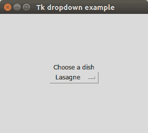

# Tk 下拉示例

> 原文： [https://pythonspot.com/tk-dropdown-example/](https://pythonspot.com/tk-dropdown-example/)

[Tkinter](https://pythonspot.com/tkinter/) 支持下拉菜单。 这类似于操作系统上的标准组合框。

该小部件称为`OptionMenu`，所需的参数为：帧，tk 变量和带有选择项的字典。



## Tkinter 下拉示例

下面的示例创建一个带有组合框的 Tkinter 窗口。

```py
from Tkinter import *
import Tkinter as ttk
from ttk import *

root = Tk()
root.title("Tk dropdown example")

# Add a grid
mainframe = Frame(root)
mainframe.grid(column=0,row=0, sticky=(N,W,E,S) )
mainframe.columnconfigure(0, weight = 1)
mainframe.rowconfigure(0, weight = 1)
mainframe.pack(pady = 100, padx = 100)

# Create a Tkinter variable
tkvar = StringVar(root)

# Dictionary with options
choices = { 'Pizza','Lasagne','Fries','Fish','Potatoe'}
tkvar.set('Pizza') # set the default option

popupMenu = OptionMenu(mainframe, tkvar, *choices)
Label(mainframe, text="Choose a dish").grid(row = 1, column = 1)
popupMenu.grid(row = 2, column =1)

# on change dropdown value
def change_dropdown(*args):
    print( tkvar.get() )

# link function to change dropdown
tkvar.trace('w', change_dropdown)

root.mainloop()

```

首先创建一个 Tk 对象，并将其传递给使用`Frame()`创建的 tkinter 框架

```py
root = Tk()
root.title("Tk dropdown example")
mainframe = Frame(root)

```

将一个网格添加到框架，该框架将容纳组合框。

```py
mainframe.grid(column=0,row=0, sticky=(N,W,E,S) )
mainframe.columnconfigure(0, weight = 1)
mainframe.rowconfigure(0, weight = 1)
mainframe.pack(pady = 100, padx = 100)

```

弹出菜单包含在变量选项中定义的选项列表。 使用以下行创建一个 Tkinter 变量：

```py
tkvar = StringVar(root)

```

变量的默认值是使用`.set()`方法设置的。 我们使用以下方法创建 Tkinter 组合框：

```py
popupMenu = OptionMenu(mainframe, tkvar, *choices)

```

并将回调方法`change_dropdown`链接到此组合框。