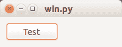

# wxPython 按钮

> 原文： [https://pythonspot.com/wxpython-buttons/](https://pythonspot.com/wxpython-buttons/)

要创建按钮，只需调用 wx.Button（）。 使用 wx.Button（）创建按钮时，将面板解析为第一个参数很重要。 我们将其附加到面板上，因为将其附加到框架上将使其全屏显示。

面板使您可以选择将小部件放置在窗口中的任何位置。 参数（10,10）是面板上的位置。 id 参数是必需的，但它等于-1（wx.ID_ANY == -1）。 第三个参数是按钮上的文本。

**相关课程：** [使用 wxPython 创建 GUI 应用程序](https://gum.co/qapqB)

您可以使用下面的代码在 [wxPython](https://pythonspot.com/wx/) 中创建一个按钮：

```
#!/usr/bin/python

import wx

def onButton(event):
    print "Button pressed."

app = wx.App()
frame = wx.Frame(None, -1, 'win.py')
frame.SetDimensions(0,0,200,50)

panel = wx.Panel(frame, wx.ID_ANY)
button = wx.Button(panel, wx.ID_ANY, 'Test', (10, 10))
button.Bind(wx.EVT_BUTTON, onButton)

frame.Show()
frame.Centre()
app.MainLoop()

```

如果按下按钮，则调用 onButton（）函数。 我们将其与 button.Bind（wx.EVT_BUTTON，onButton）绑定（连接）。

输出：

 Buton created with [wxPython](https://pythonspot.com/wx/)

**按钮上的图像** wxPython 支持在按钮上使用图像。 只需稍作更改即可在按钮上显示图像。 虽然该函数称为 wx.BitmapButton，但它支持其他图像格式。

```
bmp = wx.Bitmap("call-start.png", wx.BITMAP_TYPE_ANY)
button = wx.BitmapButton(panel, id=wx.ID_ANY, bitmap=bmp,
                          size=(bmp.GetWidth()+10, bmp.GetHeight()+10))

```

第一行加载图像，第二行创建按钮。

完整代码：

```
#!/usr/bin/python

import wx

def onButton(event):
    print "Button pressed."

app = wx.App()
frame = wx.Frame(None, -1, 'win.py')
frame.SetDimensions(0,0,200,70)
panel = wx.Panel(frame, wx.ID_ANY)

bmp = wx.Bitmap("call-start.png", wx.BITMAP_TYPE_ANY)
button = wx.BitmapButton(panel, id=wx.ID_ANY, bitmap=bmp,
                          size=(bmp.GetWidth()+10, bmp.GetHeight()+10))

button.Bind(wx.EVT_BUTTON, onButton)
button.SetPosition((10,10))

frame.Show()
frame.Centre()
app.MainLoop()

```

输出：

 wxButton