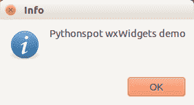
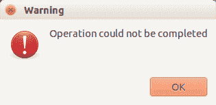

# wxPython 对话框

> 原文： [https://pythonspot.com/wxpython-dialogs/](https://pythonspot.com/wxpython-dialogs/)

要使用[显示对话框，wxPython](https://pythonspot.com/wx/) 仅需要几行代码。 我们将在下面演示。 我们将讨论信息对话框，简单对话框，错误对话框，警告对话框等。

**相关课程：** [使用 wxPython 创建 GUI 应用程序](https://gum.co/qapqB)

**信息对话框** 信息对话框可以用一行代码显示：

```
import wx

app = wx.App()
wx.MessageBox('Pythonspot wxWidgets demo', 'Info', wx.OK | wx.ICON_INFORMATION)

```

第一个参数是要显示的实际文本。 第二个是标题，最后一个参数告诉 wx 显示信息图标和按钮。

输出：

 wx dialog

**更多对话框：警告对话框，错误对话框和默认对话框** 通过修改参数，您可以轻松创建其他类型的模拟日志。 下面的例子：

```
import wx

app = wx.App()

# simple dialog
wx.MessageBox('A dialog', 'Title', wx.OK)

# warning dialog
wx.MessageBox('Operation could not be completed', 'Warning', wx.OK | wx.ICON_WARNING)

# error dialog
wx.MessageBox('Operation could not be completed', 'Error', wx.OK | wx.ICON_ERROR)

```

输出（仅对话框之一）：

 wxDialog

**问题对话框** Wx 可用于创建问题对话框（是/否）。 示例代码：

```
import wx

app = wx.App()

dlg = wx.MessageDialog(None, "Do you want to update?",'Updater',wx.YES_NO | wx.ICON_QUESTION)
result = dlg.ShowModal()

if result == wx.ID_YES:
    print "Yes pressed"
else:
    print "No pressed"

```

输出：

 wxDialog