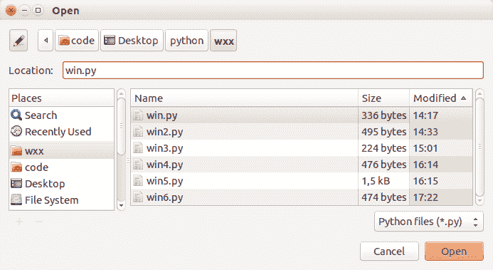

# wxPython 文件对话框

> 原文： [https://pythonspot.com/wxpython-file-dialog/](https://pythonspot.com/wxpython-file-dialog/)

几乎每个可以打开一个或多个文件的桌面应用程序都有一个文件对话框。

创建一个打开的文件对话框似乎是一个非常复杂的窗口：它包含按钮，位置，标签和许多其他小部件。 而且，此打开文件对话框的外观在每个平台上都不同：Mac OS，Windows 等。

在 wxPython 的模块配备了开放式的文件对话框，可以用几个函数的调用来创建。



[wxPython](https://pythonspot.com/wx/) Open File Dialog

## wxPython 文件对话框

The example below creates a file dialog with a native appearance using wxPython:

```
#!/usr/bin/python

import wx

def onButton(event):
    print "Button pressed."

app = wx.App()

frame = wx.Frame(None, -1, 'win.py')
frame.SetDimensions(0,0,200,50)

# Create open file dialog
openFileDialog = wx.FileDialog(frame, "Open", "", "", 
      "Python files (*.py)|*.py", 
       wx.FD_OPEN | wx.FD_FILE_MUST_EXIST)

openFileDialog.ShowModal()
print(openFileDialog.GetPath())
openFileDialog.Destroy()

```

要使用 [wxPython](https://pythonspot.com/wx/) 创建文件对话框，我们可以简单地调用 wx.FileDialog（）。 此方法的定义是：（父，消息，defaultDir，defaultFile，通配符，样式，pos） 我们用以下参数调用此方法：

```
wx.FileDialog(frame, "Open", "", "","Python files (*.py)|*.py",wx.FD_OPEN | wx.FD_FILE_MUST_EXIST)

```

（未指定默认目录或默认文件）。

showModal（）方法显示窗口：

```
openFileDialog.ShowModal()

```

如果选择一个，则命令 openFileDialog.GetPath（）返回文件的完整路径。