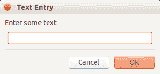

# wxPython 输入对话框

> 原文： [https://pythonspot.com/wxpython-input-dialog/](https://pythonspot.com/wxpython-input-dialog/)

输入对话框可让您的用户给您反馈或输入。 它们偶尔会出现在桌面应用程序中。

wxPython 支持输入对话框，它们包含在框架中。 典型的 wxPython 对话框如下所示：

 input dialog made with wxPython

**相关课程：** [使用 wxPython 创建 GUI 应用程序](https://gum.co/qapqB)

## wxPython 输入对话框

The example code below creates an input dialog with wxPython:

```
#!/usr/bin/python

import wx

def onButton(event):
    print "Button pressed."

app = wx.App()

frame = wx.Frame(None, -1, 'win.py')
frame.SetDimensions(0,0,200,50)

# Create text input
dlg = wx.TextEntryDialog(frame, 'Enter some text','Text Entry')
dlg.SetValue("Default")
if dlg.ShowModal() == wx.ID_OK:
    print('You entered: %s\n' % dlg.GetValue())
dlg.Destroy()

```

可以使用以下函数将 [wxPython](https://pythonspot.com/wx/) 文本框添加到窗口：

```
wx.TextEntryDialog(frame, 'Enter some text','Text Entry')

```

其中第一个参数是框架，第二个参数是标签，最后一个参数是窗口标题。

下面的函数显示对话框，并等待用户按下按钮之一：

```
dlg.ShowModal()

```

您可以通过选择以下按钮之一来按下按钮：

```
wx.OK
wx.CANCEL

```

（结果是其中之一）

给出输入后，可以使用 dlg.GetValue（）函数获取输入文本。