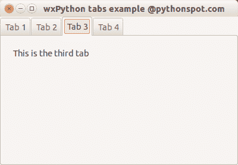

# wxPython 选项卡

> 原文： [https://pythonspot.com/wxpython-tabs/](https://pythonspot.com/wxpython-tabs/)

尽管出于简单性原因，我们并未在 [wxPython](https://pythonspot.com/wx/) 系列中大量使用面向对象，但是我们无法解决它。 在本教程中，您将学习如何使用 [wxPython](https://pythonspot.com/wx/) 创建选项卡界面。

Mainframe 类创建框架，就像前面的示例一样。 其他类别是选项卡的内容。 我们在主框架中创建一个面板和笔记本（标签夹）。 然后我们创建标签对象：

```
tab1 = TabOne(nb)
tab2 = TabTwo(nb)
...

```

我们使用以下方法将其连接到标签夹：

```
nb.AddPage(tab1, "Tab 1")
nb.AddPage(tab2, "Tab 2")
...

```

完整代码：

```
import wx

# Define the tab content as classes:
class TabOne(wx.Panel):
    def __init__(self, parent):
        wx.Panel.__init__(self, parent)
        t = wx.StaticText(self, -1, "This is the first tab", (20,20))

class TabTwo(wx.Panel):
    def __init__(self, parent):
        wx.Panel.__init__(self, parent)
        t = wx.StaticText(self, -1, "This is the second tab", (20,20))

class TabThree(wx.Panel):
    def __init__(self, parent):
        wx.Panel.__init__(self, parent)
        t = wx.StaticText(self, -1, "This is the third tab", (20,20))

class TabFour(wx.Panel):
    def __init__(self, parent):
        wx.Panel.__init__(self, parent)
        t = wx.StaticText(self, -1, "This is the last tab", (20,20))

class MainFrame(wx.Frame):
    def __init__(self):
        wx.Frame.__init__(self, None, title="wxPython tabs example @pythonspot.com")

        # Create a panel and notebook (tabs holder)
        p = wx.Panel(self)
        nb = wx.Notebook(p)

        # Create the tab windows
        tab1 = TabOne(nb)
        tab2 = TabTwo(nb)
        tab3 = TabThree(nb)
        tab4 = TabFour(nb)

        # Add the windows to tabs and name them.
        nb.AddPage(tab1, "Tab 1")
        nb.AddPage(tab2, "Tab 2")
        nb.AddPage(tab3, "Tab 3")
        nb.AddPage(tab4, "Tab 4")

        # Set noteboook in a sizer to create the layout
        sizer = wx.BoxSizer()
        sizer.Add(nb, 1, wx.EXPAND)
        p.SetSizer(sizer)

if __name__ == "__main__":
    app = wx.App()
    MainFrame().Show()
    app.MainLoop()

```

输出：

 wxTabs