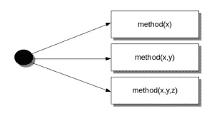

# 方法重载

> 原文： [https://pythonspot.com/method-overloading/](https://pythonspot.com/method-overloading/)



Several ways to call a method (method overloading)

在 Python 中，您可以以一种多种方式来调用它来定义方法。

给定单个方法或函数，我们可以自行指定参数数量。

根据函数定义，可以使用零个，一个，两个或多个参数来调用它。

这称为 _ 方法重载。_ 并非所有的编程语言都支持方法重载，但是 Python 支持。

## 方法重载示例

We create a class with one method sayHello(). The first parameter of this method is set to None, this gives us the option to call it with or without a parameter.

一个基于该类创建的对象，我们使用零和一个参数调用其方法。

```py
#!/usr/bin/env python

class Human:

    def sayHello(self, name=None):

        if name is not None:
            print('Hello ' + name)
        else:
            print('Hello ')

# Create instance
obj = Human()

# Call the method
obj.sayHello()

# Call the method with a parameter
obj.sayHello('Guido')

```

输出：

```py
Hello
Hello Guido

```

为了澄清 _ 方法的重载 _，我们现在可以通过两种方式调用 sayHello（）方法：

```py
obj.sayHello()
obj.sayHello('Guido')

```

我们创建了一个方法，该方法可以使用比定义所允许的参数更少的参数进行调用。

我们不仅限于两个变量，您的方法可以有更多可选的变量。

[下载练习](https://pythonspot.com/download-oop-exercises/)