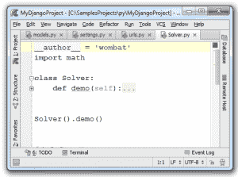

# 介绍

> 原文： [https://pythonspot.com/introduction/](https://pythonspot.com/introduction/)

欢迎来到我的 Python 课程！

Python 是一种通用的计算机编程语言。
本课程适用于 Python 2 和 Python 3。

## 下载 Python

To run Python code, you will need one of these programs:

*   [适用于 Windows，Mac 或 Linux 的 PyCharm](https://www.jetbrains.com/pycharm/)

*   [适用于 Google Android 的 QPython](https://play.google.com/store/apps/details?id=com.hipipal.qpy3)

*   [适用于 Apple iPhone 的 Pythonista](https://itunes.apple.com/us/app/pythonista/id528579881?mt=8)

*   [其他程序](https://pythonspot.com/python-ides/)

For terminal only: [Apple Mac OS X](https://www.python.org/downloads/mac-osx/), [Microsoft Windows](https://www.python.org/downloads/windows/), [Linux/UNIX](https://www.python.org/downloads/source/)

&lt;标题 ID =“ attachment_3478” align =“ alignnone” width =“ 300”] [&lt;picture&gt;&lt;source srcset="/wp-content/uploads/2016/03/pycharm-300x223.png.webp" type="image/webp"&gt; &lt;source srcset="/wp-content/uploads/2016/03/pycharm-300x223.png" type="image/jpeg"&gt;  &lt;/picture&gt; ](https://www.jetbrains.com/pycharm/) PyCharm， 流行的 Python 编辑器

## 运行 Python 代码

A python program should be save as a file with a .py extension.
Try this code:

```py
print("Hello World!")
print("This is a Python program.")

```

预期产量：

```py
Hello World!
This is a Python program

```

如果使用解释器，请使用：

```py
python program.py

```