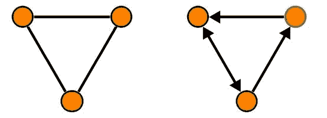

# Python 图

> 原文： [https://pythonspot.com/python-graph/](https://pythonspot.com/python-graph/)

## 介绍

数学和计算机科学中的图由节点组成，这些节点可以相互连接，也可以不相互连接。 节点之间的连接称为边。图可以是有向的（箭头）或无向的。 边可以表示距离或重量。



默认图（左），有向图（右）

Python 没有图数据类型。 要使用图，我们可以使用模块，也可以自己实现：

*   自己实现图

*   `networkx`模块

## Python 中的图

有向图可以定义为：

```py
#!/usr/bin/env python

graph = {'A': ['B', 'C'],
         'B': ['C', 'A'],
         'C': ['D'],
         'D': ['A']}

print(graph)

```

## 使用`networkx`的图

`networkx`软件模块支持创建，处理图。

```py
#!/usr/bin/env python
import networkx as nx

G=nx.Graph()
G.add_node("A")
G.add_node("B")
G.add_node("C")
G.add_edge("A","B")
G.add_edge("B","C")
G.add_edge("C","A")

print("Nodes: " + str(G.nodes()))
print("Edges: " + str(G.edges()))

```

结果：

```py
Nodes: [‘A’, ‘C’, ‘B’]
Edges: [(‘A’, ‘C’), (‘A’, ‘B’), (‘C’, ‘B’)]

```