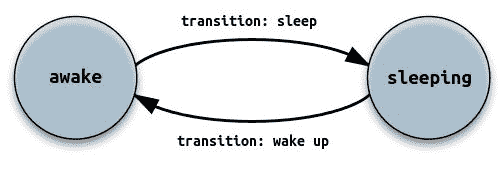

# Python 有限状态机

> 原文： [https://pythonspot.com/python-finite-state-machine/](https://pythonspot.com/python-finite-state-machine/)

## 简介

**有限状态机（FSM）**是具有状态，转换，输入和输出的数学计算模型。 这台机器当时始终处于一种状态，并且可以通过转换转移到其他状态。 转换会将计算机的状态更改为另一个状态。

可以使用有限状态机对大量问题进行建模。 自动贩卖机，电梯和交通信号灯是现代生活中使用的状态机的简单示例。 高级用法是人工智能，语言解析和通信协议设计。

## 有限状态机示例

First install the Fysom module:

```py
sudo pip install fysom
```

We can define a Finite State Machine (FSM) with two states: sleeping and awake. To move between the states we will define the transitions wakeup() and sleep().

Finite state machine. States: awake, sleeping. Transitions: sleep, wake up

例：

```py
from fysom import *

fsm = Fysom({'initial': 'awake',
             'final': 'red',
             'events': [
                 {'name': 'wakeup', 'src': 'sleeping', 'dst': 'awake'},
                 {'name': 'sleep',  'src': 'awake',   'dst': 'sleeping'}]})

print(fsm.current)   # awake
fsm.sleep()
print(fsm.current)   # sleeping
fsm.wakeup()
print(fsm.current)   # awake

```

结果：

```py

awake
sleeping
awake

```

## 有限状态机

There are several implementations of Finite State Machines in Python:

*   [Fysom](https://github.com/oxplot/fysom)
*   [Python 位 fsm](https://github.com/smontanaro/python-bits/blob/master/fsm.py)
*   [Fsme](http://fsme.sourceforge.net/)