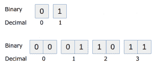
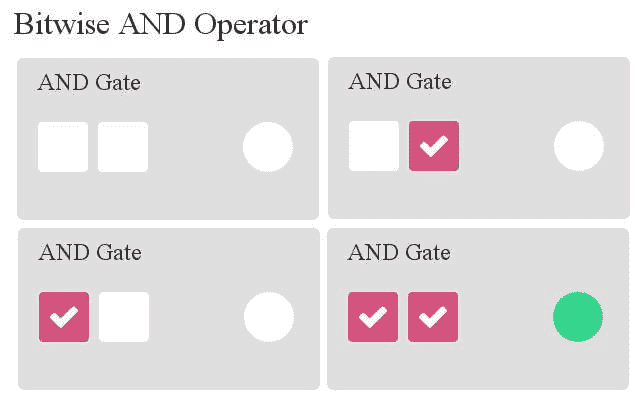
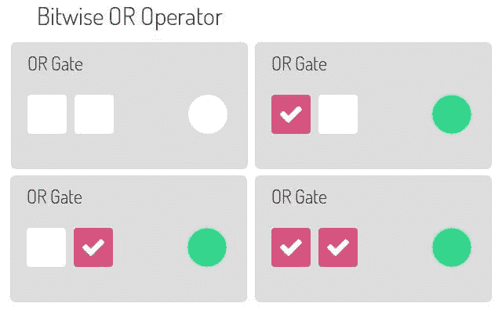
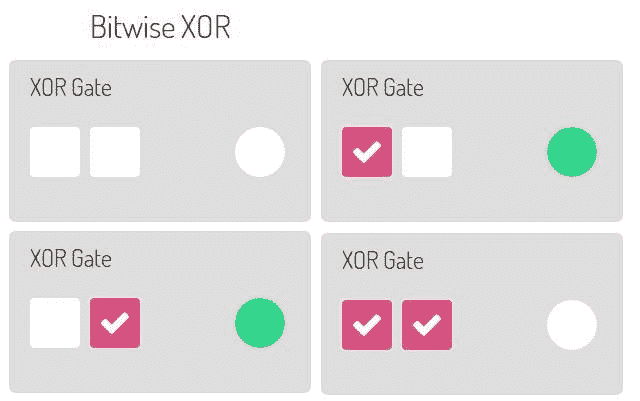

# 二进制数和逻辑运算符

> 原文： [https://pythonspot.com/binary-numbers-and-logical-operators/](https://pythonspot.com/binary-numbers-and-logical-operators/)



我们之前已经看过简单的数字和运算。 在本文中，您将学习数字在计算机内部的工作方式以及与此相关的一些魔术：-)

更详细：虽然这在 Web 应用程序或大多数桌面应用程序中没有直接用处，但了解它非常有用。

在本文中，您将学习如何在 Python 中使用二进制数，如何将其转换为小数以及如何对它们进行按位运算。

## 二进制数

At the lowest level, the computer has no notion whatsoever of numbers except ‘there is a signal’ or ‘these is not a signal’. You can think of this as a light switch: Either the switch is on or it is off.

This tiny amount of information, the smallest amount of information that you can store in a computer, is known as a _bit._ We represent a bit as either low (0) or high (1).

To represent higher numbers than 1, the idea was born to use a sequence of bits. A sequence of eight bits could store much larger numbers, this is called a _byte_. A sequence consisting of ones and zeroes is known as _binary_. Our traditional counting system with ten digits is known as decimal.

<caption id=”attachment_824” align=”alignnone” width=”300”]

Binary numbers and their decimal representation.

Lets see that in practice:

```py
# Prints out a few binary numbers.
print int('00', 2)
print int('01', 2)
print int('10', 2)
print int('11', 2)

```

The second parameter 2, tells Python we have a number based on 2 elements (1 and 0). To convert a byte (8 bits) to decimal, simple write a combination of eight bits in the first parameter.

```py
# Prints out a few binary numbers.
print int('00000010', 2)   # outputs 2
print int('00000011', 2)   # outputs 3
print int('00010001', 2)   # outputs 17
print int('11111111', 2)   # outputs 255

```

How does the computer do this? Every digit (from right to left) is multiplied by the power of two.

The number ‘000**1**000**1**‘ is (**1** x 2^0) + (0 x 2^1) + (0 x 2^2) + (0 x 2^3) + (**1** x 2^4) + (0 x 2^5) + (0 x 2^6) + (0 x 2^7) = 16 + 1 = 17\. Remember, read from right to left.

The number ‘00110010’ would be (0 x 2^0) + (1 x 2^1) + (0 x 2^2) + (0 x 2^3) + (**1** x 2^4) + (**1** x 2^5) + (0 x 2^6) + (0 x 2^7) = 32+16+2 = 50.

Try the sequence ‘00101010’ yourself to see if you understand and verify with a Python program.

## 二进制数的逻辑运算

_ 二进制左移和二进制右移 _
在二进制中，乘以因子 2 和除以因子 2 非常容易。 我们只需将位左移或右移。 我们向左下方移动：

| 4 位 | 3 位 | 2 位 | 位 1 |
| --- | --- | --- | --- |
| 0 | 1 个 | 0 | 1 个 |
| 1 个 | 0 | 1 个 | 0 |

在移位（0,1,0,1）之前，我们有数字 5。 移位（1,0,1,0）后，我们得到数字 10。在 python 中，您可以使用按位向左运算符（&lt; &lt;）向左移动，按位向右运算符（&gt; &gt;） 向右移动。

```py
inputA = int('0101',2)

print "Before shifting " + str(inputA) + " " + bin(inputA)
print "After shifting in binary: " + bin(inputA << 1)
print "After shifting in decimal: " + str(inputA << 1)

```

输出：

```py
Before shifting 5 0b101
After shifting in binary: 0b1010
After shifting in decimal: 10

```

## AND 运算子

Given two inputs, the computer can do several logic operations with those bits. Let’s take the AND operator. If input A and input B are positive, the output will be positive. We will demonstrate the AND operator graphically, the two left ones are input A and input B, the right circle is the output:<caption id=”attachment_843” align=”alignnone” width=”640”]

Bitwise AND

在代码中，这就像使用&符号一样简单，该符号代表逻辑 AND 运算符。

```py
# This code will execute a bitwise logical AND. Both inputA and inputB are bits.
inputA = 1
inputB = 1

print inputA & inputB   # Bitwise AND

```

通过更改输入，您将获得与上图相同的结果。 我们可以对一个序列执行 AND 运算符：

```py
inputA = int('00100011',2)   # define binary sequence inputA
inputB = int('00101101',2)   # define binary sequence inputB

print bin(inputA & inputB)   # logical AND on inputA and inputB and output in binary

```

输出：

```py
0b100001   # equals 00100001

```

这是有道理的，因为如果您手动进行操作：

```py
00100011
00101101
--------   Logical bitwise AND
00100001

```

## OR 运算子

Now that you have learned the AND operator, let’s have a look at the OR operator. Given two inputs, the output will be zero only if A and B are both zero.<caption id=”attachment_847” align=”alignnone” width=”640”]

binary bitwise OR

要执行它，我们使用| 操作员。 可以像这样简单地执行一系列位：

```py
inputA = int('00100011',2)  # define binary number
inputB = int('00101101',2)  # define binary number

print bin(inputA)            # prints inputA in binary
print bin(inputB)            # prints inputB in binary
print bin(inputA | inputB)   # Execute bitwise logical OR and print result in binary

```

输出：

```py
0b100011
0b101101
0b101111

```

## XOR 运算符

This is an interesting operator: The Exclusive OR or shortly XOR.<caption id=”attachment_849” align=”alignnone” width=”640”]

bitwise XOR

为了执行它，我们使用^运算符。 可以像这样简单地执行一系列位：

```py
inputA = int('00100011',2)  # define binary number
inputB = int('00101101',2)  # define binary number

print bin(inputA)            # prints inputA in binary
print bin(inputB)            # prints inputB in binary
print bin(inputA ^ inputB)   # Execute bitwise logical OR and print result in binary

```

输出：

```py
0b100011
0b101101
0b1110

```