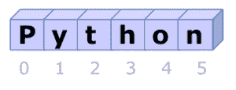

# Python 字符串

> 原文： [https://pythonspot.com/python-strings/](https://pythonspot.com/python-strings/)



字符串，一系列字符

字符串是一系列字符，它们通常用于显示文本。

要定义字符串，只需在引号之间输入文本。 Python 接受单引号，双引号和三引号。

## 字符串输入和输出

要将文本（字符串）输出到屏幕：

```py
s = "hello world"
print(s)

```

要从键盘获取文本：

```py

name = input("Enter name: ")
print(name)

```

如果您使用的是**旧的 Python 版本（2.x）**，则需要使用：

```py

name = raw_input("Enter name: ")
print(name)

```

要测试您的版本，请执行以下操作：
_python –version_

## 字符串比较

要测试两个字符串是否相等，请使用相等运算符（`==`）。

```py
#!/usr/bin/python

sentence = "The cat is brown"
q = "cat"

if q == sentence:
    print('strings equal')

```

要测试两个字符串是否相等，请使用 inequality 运算符（！=）

```py
#!/usr/bin/python

sentence = "The cat is brown"
q = "cat"

if q != sentence:
    print('strings equal')

```

[下载 Python 练习](https://pythonspot.com/download-python-exercises/)