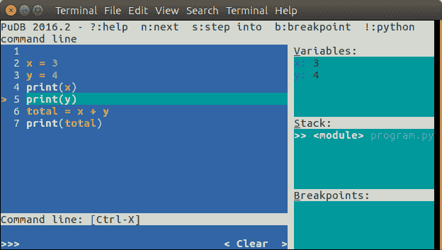
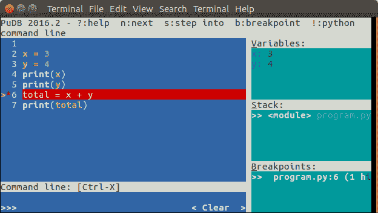

# Python 调试

> 原文： [https://pythonspot.com/python-debugging/](https://pythonspot.com/python-debugging/)

我们可以使用调试工具来最小化和发现错误。 在本文中，您将学习最佳的 Python 调试技巧。

## PuDB-基于控制台的 Python 调试器



使用 PuDB 进行 Python 调试

使用 PuDB 终端显示了图形界面。

## 安装

，以便与 Python 3 一起安装：

```py

sudo pip3 install pudb

```

对于 Python 2.x 使用：

```py

sudo pip install pudb

```

## 调试

使用以下命令开始调试：

```py

$ pudb3 program.py 

```

（或 sudo（如果您没有正确的权限））

您可以逐步完成该程序。 使用 **n** 键逐步执行该程序。 当前变量内容显示在右上方。


python 调试

您可以使用 **b** 键设置断点。 要继续执行直到下一个断点，请按 **c** 键。



Python 程序中的断点

## PDB-Python 调试器

`pdb`模块支持设置断点。 断点是程序的有意暂停。 您可以在其中获取有关程序状态的更多信息。

要设置断点，请插入行

```py

pdb.set_trace()

```

## 示例

实际示例：

```py

import pdb

x = 3
y = 4
pdb.set_trace()

total = x + y
pdb.set_trace()

```

我们在该程序中插入了一些断点。 程序将在每个断点处暂停（ **pdb.set_trace（）**）。 要查看变量内容，只需键入变量名称：

```py

$ python3 program.py
(Pdb) x
3
(Pdb) y
4
(Pdb) total
*** NameError: name 'total' is not defined
(Pdb) 

```

按 **c** 或**继续**继续执行程序，直到下一个断点

```py

(Pdb) c
--Return--
> program.py(7)<module>()->None
-> total = x + y
(Pdb) total
7

```