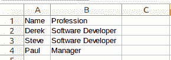

# 创建并读取 csv

> 原文： [https://pythonspot.com/files-spreadsheets-csv/](https://pythonspot.com/files-spreadsheets-csv/)

电子表格通常会导出 CSV（逗号分隔值）文件，因为它们易于读写。 CSV 文件仅由值，逗号和换行符组成。 该文件称为“逗号分隔值”文件，但您可以使用其他分隔符，例如竖线字符。

## 用 Python 创建电子表格文件（CSV）

让我们使用 Python 创建 CSV 格式的文件。 我们将使用逗号作为分隔符或除法符。

```py
import csv

with open('persons.csv', 'wb') as csvfile:
    filewriter = csv.writer(csvfile, delimiter=',',
                            quotechar='|', quoting=csv.QUOTE_MINIMAL)
    filewriter.writerow(['Name', 'Profession'])
    filewriter.writerow(['Derek', 'Software Developer'])
    filewriter.writerow(['Steve', 'Software Developer'])
    filewriter.writerow(['Paul', 'Manager'])

```

运行此代码将为我们提供以下内容的 filpeople.csv：

```py
Name,Profession
Derek,Software Developer
Steve,Software Developer
Paul,Manager

```

您可以在您喜欢的 Office 程序中导入 person.csv 文件。



Spreadsheet file created in Python

## 读取电子表格文件（csv）

如果您创建了 csv 文件，则可以使用以下代码逐行读取文件：

```py
import csv

# open file
with open('persons.csv', 'rb') as f:
    reader = csv.reader(f)

    # read file row by row
    for row in reader:
        print row

```

这将简单地将每一行显示为列表：

```py
['Name', 'Profession']
['Derek', 'Software Developer']
['Steve', 'Software Developer']
['Paul', 'Manager']

```

也许您想将其存储到 Python 列表中。 我们从 csv 文件中获取数据，然后将其存储到 Python 列表中。 我们使用 if 语句跳过标题，因为它不属于列表。 完整代码：

```py
import csv

# create list holders for our data.
names = []
jobs = []

# open file
with open('persons.csv', 'rb') as f:
    reader = csv.reader(f)

    # read file row by row
    rowNr = 0
    for row in reader:
        # Skip the header row.
        if rowNr >= 1:
            names.append(row[0])
            jobs.append(row[1])

        # Increase the row number
        rowNr = rowNr + 1

# Print data 
print names
print jobs

```

结果：

```py
['Derek', 'Steve', 'Paul']
['Software Developer', 'Software Developer', 'Manager']

```

大多数电子表格或 Office 程序都可以导出 csv 文件，因此我们建议您创建任何类型的 csv 文件并进行处理:-)

