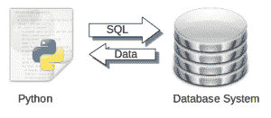
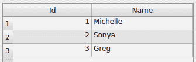
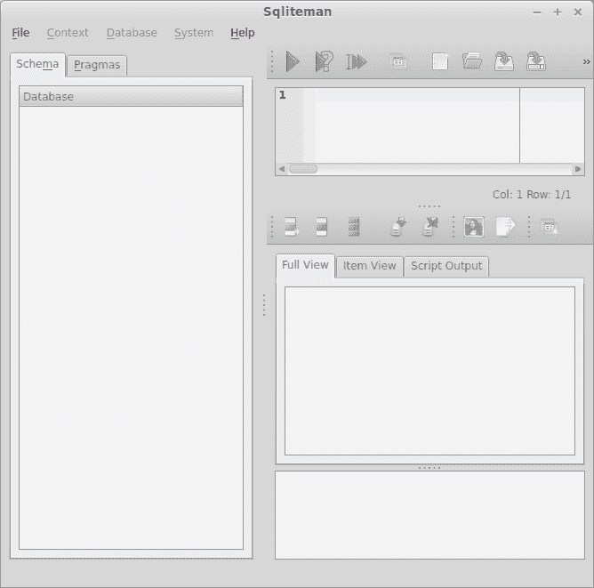
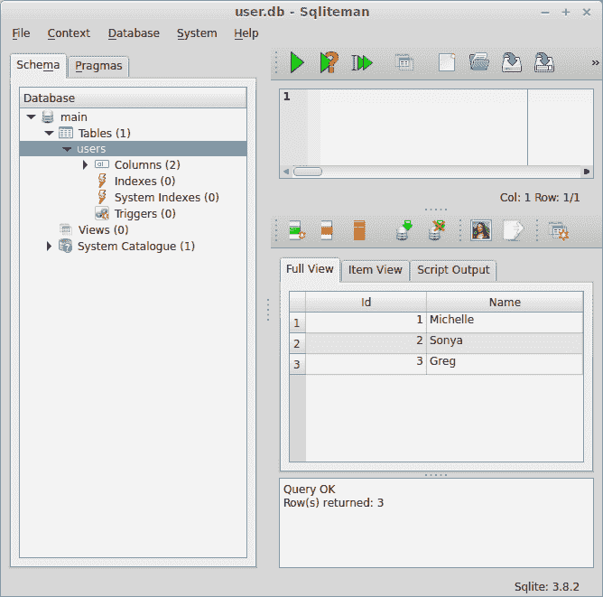
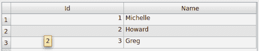
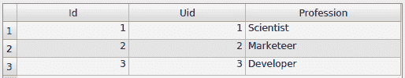

# Python 数据库编程：SQLite（教程）

> 原文： [https://pythonspot.com/python-database-programming-sqlite-tutorial/](https://pythonspot.com/python-database-programming-sqlite-tutorial/)

在本教程中，您将学习如何在 Python 中使用 SQLite [数据库](https://pythonspot.com/python-database/)管理系统。 您将学习如何使用 SQLite，SQL 查询，RDBMS 以及更多有趣的东西！


## Pyton 数据库



Python数据库。

使用 SQL 语言从数据库系统检索数据。 数据无处不在，软件应用程序使用它。 数据位于内存，文件或数据库中。

Python 具有许多数据库系统的绑定，包括 [MySQL](https://pythonspot.com/mysql-with-python), [Postregsql](https://pythonspot.com/python-database-postgresql/), Oracle, Microsoft SQL Server 和 Maria DB。

这些数据库管理系统（DBMS）之一称为 SQLite。 SQLite 创建于 2000 年，是数据库动物园中众多管理系统之一。

SQL 是专用于管理[数据库](https://pythonspot.com/python-database/)中保存的数据的专用编程语言。该语言自 1986 年以来一直存在，值得学习。[这是关于 SQL 的古老有趣的视频](https://www.youtube.com/watch?v=5ycx9hFGHog)。

## SQLite


SQLite，一个关系数据库管理系统。SQLite 是世界上部署最广泛的 SQL 数据库引擎。SQLite 的源代码位于公共领域。

它是一个自包含，无服务器，零配置的事务型 SQL 数据库引擎。SQLite 项目由彭博社和 Mozilla 赞助。

## 安装 SQLite：

使用此命令安装 SQLite：

```py
$ sudo apt-get install sqlite

```

验证是否正确安装。 复制此程序并将其另存为`test1.py`

```py
#!/usr/bin/python
# -*- coding: utf-8 -*-

import sqlite3 as lite
import sys

con = None

try:
    con = lite.connect('test.db')
    cur = con.cursor()  
    cur.execute('SELECT SQLITE_VERSION()')
    data = cur.fetchone()
    print "SQLite version: %s" % data                
except lite.Error, e:   
    print "Error %s:" % e.args[0]
    sys.exit(1)
finally:    
    if con:
        con.close()

```

执行：

```py
$ python test1.py

```

它应该输出：

```py
SQLite version: 3.8.2

```

## 上面的脚本做了什么？

该脚本使用以下代码行连接到名为`test.db`的新数据库：

```py
con = lite.connect('test.db')

```

然后，它使用以下命令查询数据库管理系统

```py
SELECT SQLITE_VERSION()

```

依次返回其版本号。 该行称为 SQL 查询。

## SQL 创建和插入

下面的脚本会将数据存储到名为`user.db`的新数据库中

```py
#!/usr/bin/python
# -*- coding: utf-8 -*-

import sqlite3 as lite
import sys

con = lite.connect('user.db')

with con:

    cur = con.cursor()    
    cur.execute("CREATE TABLE Users(Id INT, Name TEXT)")
    cur.execute("INSERT INTO Users VALUES(1,'Michelle')")
    cur.execute("INSERT INTO Users VALUES(2,'Sonya')")
    cur.execute("INSERT INTO Users VALUES(3,'Greg')")

```

SQLite 是使用表的数据库管理系统。 这些表可以与其他表建立关系：称为关系数据库管理系统或 RDBMS。 该表定义了数据的结构并可以保存数据。 数据库可以容纳许多不同的表。 使用以下命令创建表：

```py
cur.execute("CREATE TABLE Users(Id INT, Name TEXT)")

```

我们使用以下命令将记录添加到表中：

```py
cur.execute("INSERT INTO Users VALUES(2,'Sonya')")
cur.execute("INSERT INTO Users VALUES(3,'Greg')")

```

第一个值是ID。 第二个值是名称。 一旦运行脚本，数据便被插入到数据库表`Users`中：



SQL 表

## SQLite 查询数据

我们可以使用两种方法浏览数据库：命令行和图形界面。

_ 从控制台：_ 要使用命令行进行浏览，请键入以下命令：

```py
sqlite3 user.db
.tables
SELECT * FROM Users;

```

这将在表 Users 中输出数据。

```py
sqlite&gt; SELECT * FROM Users;
1|Michelle
2|Sonya
3|Greg

```

_ 从 GUI：_ 如果要使用 GUI，则有很多选择。 我个人选择了 sqllite-man，但还有[很多其他](https://stackoverflow.com/questions/835069/which-sqlite-administration-console-do-you-recommend)。 我们使用以下方法安装：

```py
sudo apt-get install sqliteman

```

我们启动应用程序 sqliteman。 gui 弹出。



sqliteman

按文件&gt;打开&gt;user.db。 似乎变化不大，不用担心，这只是用户界面。 左侧是一棵小树状视图，请按 Tables &gt;用户。 现在将显示包括所有记录的完整表格。



sqliteman

该 GUI 可用于修改表中的记录（数据）并添加新表。

## SQL 数据库查询语言

SQL 有许多命令可以与[数据库](https://pythonspot.com/python-database/)进行交互。 您可以从命令行或 GUI 尝试以下命令：

```py
sqlite3 user.db 
SELECT * FROM Users;
SELECT count(*) FROM Users;
SELECT name FROM Users;
SELECT * FROM Users WHERE id = 2;
DELETE FROM Users WHERE id = 6;

```

我们可以在 Python 程序中使用这些查询：

```py
#!/usr/bin/python
# -*- coding: utf-8 -*-

import sqlite3 as lite
import sys

con = lite.connect('user.db')

with con:    

    cur = con.cursor()    
    cur.execute("SELECT * FROM Users")

    rows = cur.fetchall()

    for row in rows:
        print row

```

这将从数据库输出“用户”表中的所有数据：

```py
$ python get.py 
(1, u'Michelle')
(2, u'Sonya')
(3, u'Greg')

```

## 创建用户信息数据库


我们可以跨多个表构建数据。 这使我们的数据保持结构化，快速和有条理。 如果我们只有一个表来存储所有内容，那么很快就会陷入混乱。 我们将要做的是创建多个表并将它们组合使用。 我们创建两个表：

_ 位用户：_



SQL Table

_ 职位：_



SQL Table

要创建这些表，您可以在 GUI 中手动进行操作或使用以下脚本：

```py
# -*- coding: utf-8 -*-

import sqlite3 as lite
import sys

con = lite.connect('system.db')

with con:

    cur = con.cursor()    
    cur.execute("CREATE TABLE Users(Id INT, Name TEXT)")
    cur.execute("INSERT INTO Users VALUES(1,'Michelle')")
    cur.execute("INSERT INTO Users VALUES(2,'Howard')")
    cur.execute("INSERT INTO Users VALUES(3,'Greg')")

    cur.execute("CREATE TABLE Jobs(Id INT, Uid INT, Profession TEXT)")
    cur.execute("INSERT INTO Jobs VALUES(1,1,'Scientist')")
    cur.execute("INSERT INTO Jobs VALUES(2,2,'Marketeer')")
    cur.execute("INSERT INTO Jobs VALUES(3,3,'Developer')")

```

作业表有一个额外的参数 Uid。 我们使用它来连接 SQL 查询中的两个表：

```py
SELECT users.name, jobs.profession FROM jobs INNER JOIN users ON users.ID = jobs.uid

```

您可以将该 SQL 查询合并到 Python 脚本中：

```py
#!/usr/bin/python
# -*- coding: utf-8 -*-

import sqlite3 as lite
import sys

con = lite.connect('system.db')

with con:    

    cur = con.cursor()    
    cur.execute("SELECT users.name, jobs.profession FROM jobs INNER JOIN users ON users.ID = jobs.uid")

    rows = cur.fetchall()

    for row in rows:
        print row

```

它应该输出：

```py
$ python get2.py
(u'Michelle', u'Scientist')
(u'Howard', u'Marketeer')
(u'Greg', u'Developer')

```

您可能会喜欢：[数据库和数据分析](https://pythonspot.com/python-database/)