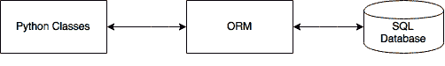
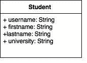
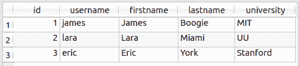

# SqlAlchemy 和 ORM

> 原文： [https://pythonspot.com/orm-with-sqlalchemy](https://pythonspot.com/orm-with-sqlalchemy)

对象关系映射器将关系数据库系统映射到对象。如果您不熟悉面向对象的编程，请先阅读[本教程](https://pythonspot.com/objects-and-classes)。ORM 与使用哪个关系数据库系统无关。在 Python 中，您可以与对象对话，ORM 会将其映射到数据库。在本文中，您将学习如何使用 SqlAlchemy ORM。

下图显示了 ORM 的功能：



ORM 对象关系映射。 我们使用 ORM 与数据库进行通信，并且仅使用 Python 对象和类。

## 创建一个类来填充 ORM

我们创建文件`tabledef.py`。 在这个文件中，我们将定义一个`Student`类。 下面是类的抽象可视化：



类定义

请注意，我们没有定义任何方法，仅定义了类的变量。 这是因为我们会将此类映射到数据库，因此不需要任何方法。

这是`tabledef.py`的内容：

```py
from sqlalchemy import *
from sqlalchemy import create_engine, ForeignKey
from sqlalchemy import Column, Date, Integer, String
from sqlalchemy.ext.declarative import declarative_base
from sqlalchemy.orm import relationship, backref

engine = create_engine('sqlite:///student.db', echo=True)
Base = declarative_base()

########################################################################
class Student(Base):
    """"""
    __tablename__ = "student"

    id = Column(Integer, primary_key=True)
    username = Column(String)
    firstname = Column(String)
    lastname = Column(String)
    university = Column(String)

    #----------------------------------------------------------------------
    def __init__(self, username, firstname, lastname, university):
        """"""
        self.username = username
        self.firstname = firstname
        self.lastname = lastname
        self.university = university

# create tables
Base.metadata.create_all(engine)

```

执行：

```py
python tabledef.py

```

ORM 创建了数据库文件`tabledef.py`。 它将 SQL 查询输出到屏幕，在本例中显示为：

```py
CREATE TABLE student (
	id INTEGER NOT NULL, 
	username VARCHAR, 
	firstname VARCHAR, 
	lastname VARCHAR, 
	university VARCHAR, 
	PRIMARY KEY (id)
)

```

因此，当我们定义一个类时，ORM 为我们创建了数据库表。 该表仍然为空。

## 将数据插入数据库

数据库表仍然为空。 我们可以使用 Python 对象将数据插入数据库。 因为我们使用 SqlAlchemy ORM，所以我们不必编写单个 SQL 查询。 现在，我们只需创建要馈送到 ORM 的 Python 对象。 将下面的代码另存为`dummy.py`

```py
import datetime
from sqlalchemy import create_engine
from sqlalchemy.orm import sessionmaker
from tabledef import *

engine = create_engine('sqlite:///student.db', echo=True)

# create a Session
Session = sessionmaker(bind=engine)
session = Session()

# Create objects  
user = Student("james","James","Boogie","MIT")
session.add(user)

user = Student("lara","Lara","Miami","UU")
session.add(user)

user = Student("eric","Eric","York","Stanford")
session.add(user)

# commit the record the database
session.commit()

```

执行：

```py
python dummy.py

```

ORM 会将 Python 对象映射到关系数据库。 这意味着您无需与应用程序进行任何直接交互，只需与对象进行交互即可。 如果您使用 SQLiteman 或 SQLite 数据库应用程序打开数据库，则会发现该表已创建：



数据表中的数据。

## 查询数据

我们可以使用以下代码查询表的所有项目。 请注意，Python 将每条记录视为`Student`类定义的唯一对象。 将代码另存为`demo.py`

```py
import datetime
from sqlalchemy import create_engine
from sqlalchemy.orm import sessionmaker
from tabledef import *

engine = create_engine('sqlite:///student.db', echo=True)

# create a Session
Session = sessionmaker(bind=engine)
session = Session()

# Create objects  
for student in session.query(Student).order_by(Student.id):
    print student.firstname, student.lastname

```

执行后，您将看到：

```py
James Boogie
Lara Miami
Eric York

```

要选择单个对象，请使用`filter()`方法。 下面的演示：

```py
import datetime
from sqlalchemy import create_engine
from sqlalchemy.orm import sessionmaker
from tabledef import *

engine = create_engine('sqlite:///student.db', echo=True)

# create a Session
Session = sessionmaker(bind=engine)
session = Session()

# Select objects  
for student in session.query(Student).filter(Student.firstname == 'Eric'):
    print student.firstname, student.lastname

```

输出：

```py
Eric York

```

最后，如果您不希望 ORM 输出，则任何 SQL 查询的输出都将`create_engine`语句更改为：

```py
engine = create_engine('sqlite:///student.db', echo=False)

```