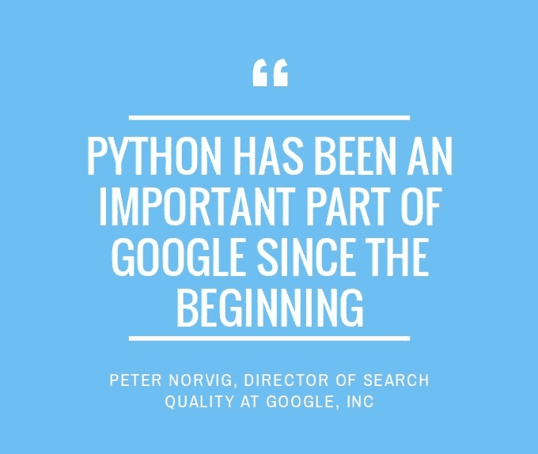
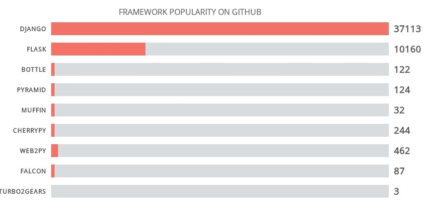

# Python Web 开发

> 原文： [https://pythonspot.com/python-web-development/](https://pythonspot.com/python-web-development/)

## 介绍



Web 应用程序通常是使用框架创建的。 框架使开发可扩展，可靠和可维护的 Web 应用程序变得更加容易。 这样可以避免一遍又一遍地重新创建相同的代码。
的共同特征是：

*   URL 路由
*   输出模板
*   数据库管理
*   会话管理
*   防范常见攻击

A framework may offer some or all of these features.

例如，Flask Web 应用程序框架不支持数据库，您将需要一个单独的模块来使用数据库。 Django Web 应用程序框架默认支持数据库。

**相关课程：** [使用 Python Flask 创建网络应用](https://gum.co/IMzBy)

## 为什么要使用 Web 框架？

As you are doing web development, you want to avoid spending time on programming things that have already been solved. On the other hand, if you are an experienced web developer a web framework may not offer everything you need.

## 存在哪些 Python Web 框架？

Django and Flask are the most popular web frameworks. However, you may want to evaluate the frameworks. An overview:

*   [Django](https://www.djangoproject.com/)
*   [Flask](http://flask.pocoo.org/)
*   [瓶](http://bottlepy.org/docs/dev/index.html)
*   [金字塔](http://www.pylonsproject.org/projects/pyramid/about)
*   [松饼](https://github.com/klen/muffin)
*   [CherryPy](http://www.cherrypy.org/)
*   [web2py](http://www.web2py.com/)
*   [猎鹰](http://falconframework.org/)
*   [Turbo2Gears](http://turbogears.org/)

The most popular python web application framework is **Django**, followed by **Flask**.

[&lt;picture&gt;&lt;source srcset="/wp-content/uploads/2015/08/python-web-development.jpg.webp" type="image/webp"&gt; &lt;source srcset="/wp-content/uploads/2015/08/python-web-development.jpg" type="image/jpeg"&gt;  &lt;/picture&gt;](/wp-content/uploads/2015/08/python-web-development.jpg) 在 Github 上提及框架的项目数量。

## Django


[Django](https://www.djangoproject.com/) 是最常用的 Python 网络框架。 它会处理很多事情，因此您可以专注于 Web 应用程序开发。 使用 Django 构建的网站处理的流量峰值很高，例如每秒 5 万次点击。

数据库访问是通过对象关系映射器实现的：您使用 Python 定义数据模型，而 Django 处理实际的数据库管理系统（SQL）。 但是，如果需要，您可以使用 Django 编写自己的 SQL 查询。 Django 支持 URL 路由。 它鼓励使用精美的 URL 设计，例如不带.php 或.asp 的结尾。

**功能**：

*   对象关系映射器
*   网址路由和视图
*   模板引擎
*   形式
*   认证方式
*   管理员
*   国际化
*   安全

If you want to know more about Django, [read here.](https://pythonspot.com/django-tutorial-building-a-note-taking-app/)Did you know the websites of [NASA](https://www.nasa.gov/), [Bitbucket](https://bitbucket.org/) and [Pinterest](https://www.pinterest.com/) were made with Django?

## Flask


[Flask](http://flask.pocoo.org/) is a Python micro framework which is modular by design. The framework is intended to build web apps. Flask does not have a specific database system or ORM system. If you want to use a database, you’ll have to use extensions. Flask is often combined with SQLAlchemy for database use.

Flask is very easy to get running, a minimal app would be:

```py
from flask import Flask
app = Flask(__name__)

@app.route('/')
def hello_world():
    return 'Hello World!'

if __name__ == '__main__':
    app.run()

```

The framework supports URL routing, template (using Jinja2), session management and has some out of the box security.

**Features**:

*   URL 路由和视图

*   模板引擎

*   会话管理

*   记录中

If you want to know more about Flask[, read here.](https://pythonspot.com/python-flask-tutorials/)
Did you know Flask started as an April Fools joke?

## Python 托管

To run your app on the web, you will need hosting. Unless you want to do hosting yourself, you need a party to host.
Hosting servers:

*   [PythonAnywhere.com](https://www.pythonanywhere.com/?affiliate_id=00535ced)

*   [适用于 Python 的 Vultr VPS](https://www.vultr.com/?ref=7208785)