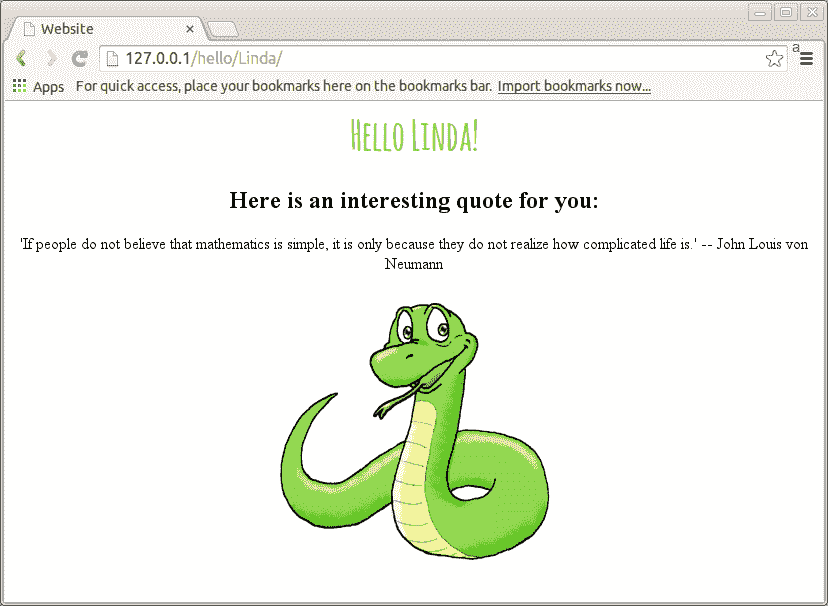
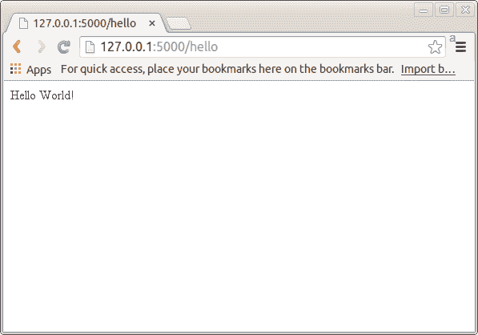
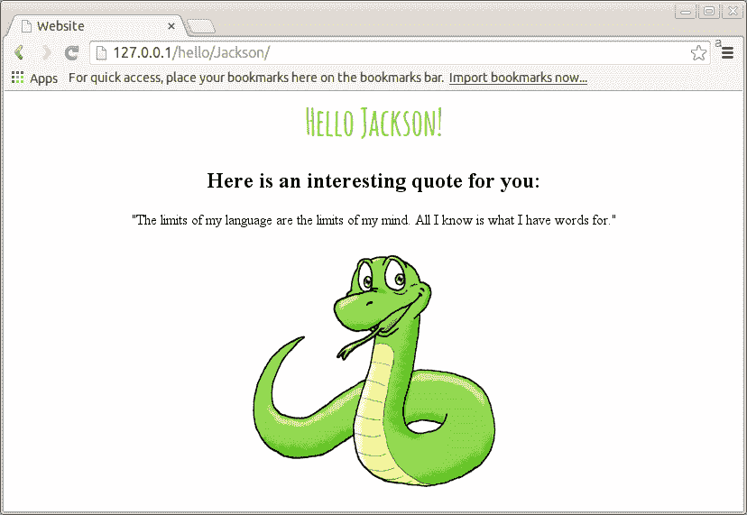

# Python 和 Flask Web 应用程序（入门教程）

> 原文： [https://pythonspot.com/flask-web-app-with-python/](https://pythonspot.com/flask-web-app-with-python/)



Python app created with Flask

在本教程中，您将学习如何使用 Python 构建网络应用。 我们将使用称为 Flask 的微型框架。

## 为什么是 Flask？


*   易于使用。

*   内置开发服务器和调试器

*   集成单元测试支持

*   RESTful 请求分派

*   使用 Jinja2 模板

*   支持安全 cookie（客户端会话）

*   100％符合 WSGI 1.0

*   基于 Unicode

*   大量记录

## 创建 URL 路由

URL Routing makes URLs in your Web app easy to remember. We will now create some URL routes:

```py
/hello
/members/
/members/name/

```

复制下面的代码，并将其另存为 app.py

```py
from flask import Flask
app = Flask(__name__)

@app.route("/")
def index():
    return "Index!"

@app.route("/hello")
def hello():
    return "Hello World!"

@app.route("/members")
def members():
    return "Members"

@app.route("/members/<string:name>/")
def getMember(name):
    return name</string:name>

if __name__ == "__main__":
    app.run()

```

使用以下命令重新启动应用程序：

```py
$ python hello.py
* Running on http://localhost:5000/

```

在浏览器中尝试网址：

*   [http://127.0.0.1:5000/](http://127.0.0.1:5000/)

*   [http://127.0.0.1:5000/您好](http://127.0.0.1:5000/hello)

*   [http://127.0.0.1:5000/成员](http://127.0.0.1:5000/members)

*   [http://127.0.0.1:5000/members/Jordan/](http://127.0.0.1:5000/members/Jordan/)



python-flask-webapp

## Flask 页面模板

We will separate code and User Interface using a technique called Templates. We make the directory called /templates/ and create the template:

```py

<h1>Hello { {name}}</h1>

```

The Python Flask app with have a new URL route. We have changed the default port to 80, the default HTTP port:

```py
from flask import Flask, flash, redirect, render_template, request, session, abort

app = Flask(__name__)

@app.route("/")
def index():
    return "Flask App!"

@app.route("/hello/<string:name>/")
def hello(name):
    return render_template(
    'test.html',name=name)</string:name>

if __name__ == "__main__":
    app.run(host='0.0.0.0', port=80)

```

You can then open : [http://127.0.0.1/hello/Jackson/](http://127.0.0.1/hello/Jackson/)

## 给模板添加样式

Do you want some better looking template? We modify the file:

```py
&#123;% extends "layout.html" %&#125;
&#123;% block body %&#125;
<div class="block1">
<h1>Hello { {name}}!</h1>
<h2>Here is an interesting quote for you:</h2>
"The limits of my language are the limits of my mind. All I know is what I have words for."


</div>
&#123;% endblock %&#125;

```

We then create layout.html which defines the look of the page. (You may want to split the stylesheet and layout.html file). Copy this as layout.html

```py

<title>Website</title>

<style>
@import url(http://fonts.googleapis.com/css?family=Amatic+SC:700);</p>
<p>body{<br />
    text-align: center;<br />
}<br />
h1{<br />
    font-family: 'Amatic SC', cursive;<br />
    font-weight: normal;<br />
    color: #8ac640;<br />
    font-size: 2.5em;<br />
}</p>
</style>&#123;% block body %&#125;&#123;% endblock %&#125;

```

Restart the App and open the url. [http://127.0.0.1/hello/Jackson/](http://127.0.0.1/hello/Jackson/)
You can pick any name other than Jackson.



python webapp flask

## 传递变量

Lets display random quotes instead of always the same quote. We will need to pass both the _name variable_ and the _quote variable_. To pass multiple variables to the function, we simply do this:

```py
    return render_template(
'test.html',**locals())

```

Our new _test.html template_ will look like this:

```py
&#123;% extends "layout.html" %&#125;
&#123;% block body %&#125;
<div class="block1">
<h1>Hello { {name}}!</h1>
<h2>Here is an interesting quote for you:</h2>
{ {quote}}


</div>
&#123;% endblock %&#125;

```

We will need to pick a random quote. To do so, we use this code:

```py
    quotes = [ "'If people do not believe that mathematics is simple, it is only because they do not realize how complicated life is.' -- John Louis von Neumann ",
"'Computer science is no more about computers than astronomy is about telescopes' --  Edsger Dijkstra ",
"'To understand recursion you must first understand recursion..' -- Unknown",
"'You look at things that are and ask, why? I dream of things that never were and ask, why not?' -- Unknown",
"'Mathematics is the key and door to the sciences.' -- Galileo Galilei",
"'Not everyone will understand your journey. Thats fine. Its not their journey to make sense of. Its yours.' -- Unknown"  ]
randomNumber = randint(0,len(quotes)-1)
quote = quotes[randomNumber]

```

The first thing you see is we have defined an array of multiples quotes. These can be accessed as quote[0], quote[1], quote[2] and so on. The function **randint()** returns a random number between 0 and the total number of quotes, one is subtracted because we start counting from zero. Finally we set the quote variable to the quote the computer has chosen. Copy the code below to app.py:

```py
from flask import Flask, flash, redirect, render_template, request, session, abort
from random import randint

app = Flask(__name__)

@app.route("/")
def index():
    return "Flask App!"

#@app.route("/hello/<string:name>")
@app.route("/hello/<string:name>/")
def hello(name):
    #    return name

quotes = [ "'If people do not believe that mathematics is simple, it is only because they do not realize how complicated life is.' -- John Louis von Neumann ",
"'Computer science is no more about computers than astronomy is about telescopes' --  Edsger Dijkstra ",
"'To understand recursion you must first understand recursion..' -- Unknown",
"'You look at things that are and ask, why? I dream of things that never were and ask, why not?' -- Unknown",
"'Mathematics is the key and door to the sciences.' -- Galileo Galilei",
"'Not everyone will understand your journey. Thats fine. Its not their journey to make sense of. Its yours.' -- Unknown"  ]
randomNumber = randint(0,len(quotes)-1)
quote = quotes[randomNumber] </string:name></string:name>

return render_template(
    'test.html',**locals())

if __name__ == "__main__":
    app.run(host='0.0.0.0', port=80)

```

When you restart the application it will return one of these quotes at random.


python flask webap

[下载应用程序以及更多烧瓶示例](https://pythonspot.com/en/download-flask-examples/)

## 接下来是什么？

您可以将您的站点链接到数据库系统，例如 MySQL，MariaDb 或 SQLite。 您可以在中找到 [SQLite 教程。 享受创建您的应用程序的乐趣！](https://pythonspot.com/en/python-database-programming-sqlite-tutorial/)